# Домашнее задание к занятию "3.2. Работа в терминале, лекция 2"

1. Это builtin (встроенная) команда Bash, она изменяет текущий каталог. Встроенная для того чтобы менять текущую папку только для оболочки, в которой выполняется.      
     
   
1. `grep 12345 /tmp/some_file.txt -c`  
     
   
1. systemd  
     
   
1. `ls -l \root 2>/dev/pts/1`  
   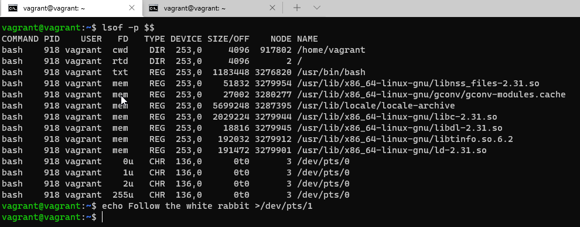  
   
     
   
1. Получится.  
   `cat </tmp/some_file.txt >/tmp/some_file_out.txt`  
   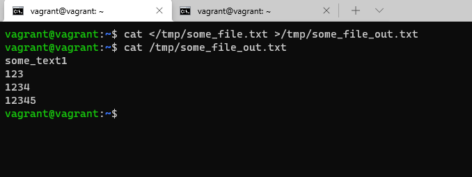  
   
1. Получится, подключившись по ssh, авторизовавшись под root (иначе будет ошибка `Permission denied`), и перенаправив вывод команды `grep some /tmp/some_file.txt` В `tty1`.  
   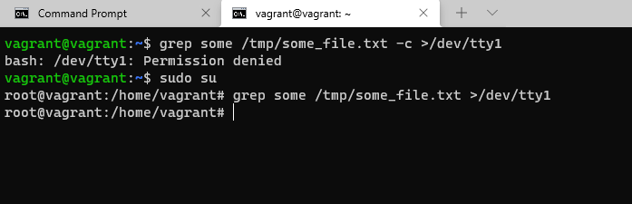  
   
   Результат можно будет наблюдать в консоли virtualbox tty1.  
   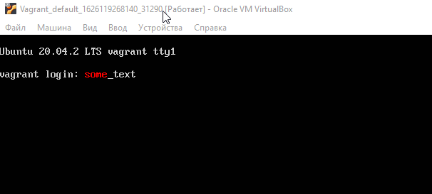  
   
1. Команда `bash 5>&1` cоздаст для нашего процесса дескриптор  `5` и перенаправит его в stdout. Команда `echo netology > /proc/$$/fd/5` перенаправит строку `netology` в дескриптор `5` и соответстенно выведет её на экран.  
   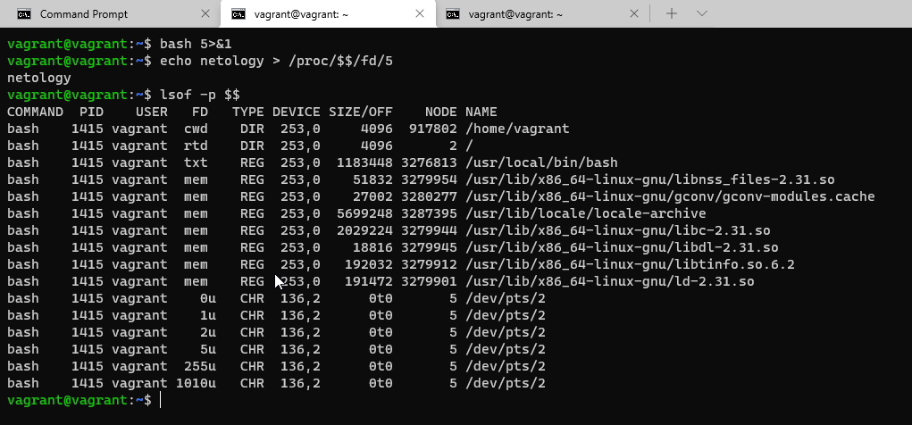  
   
1.  Получится, командой `cat 123 1234 6>&2 2>&1 1>&6 | grep file` создается новый дескриптор `6` перенаправляет его в `stderr`, `stderr` перенаправляется в `stdout`, `stdout`  перенаправляется в новый дескриптор `6`, и уже потом выполняется команда `grep file` которая находится после pipe.  
   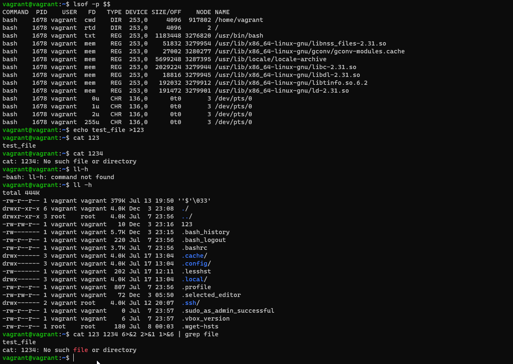  
   
1. Команда `cat /proc/$$/environ` отобразит все переменные текущего окружения (bash).  
   Получить аналогичный по содержанию вывод можно предварительно узнав PID текущего окружения командой `echo $$` и подставив его вместо `$$` в предыдущую команду.  
   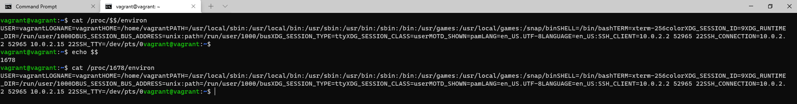  
   
1. `/proc/<PID>/cmdline` - файл который содержит полную командную строку для процесса, если только процесс не является зомби. (строка 178).  
   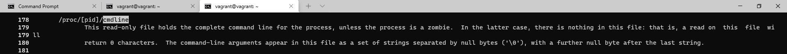  
   `/proc/<PID>/exe` - это символическая ссылка, содержащая фактический путь к исполняемой команде. (строка 219).  
   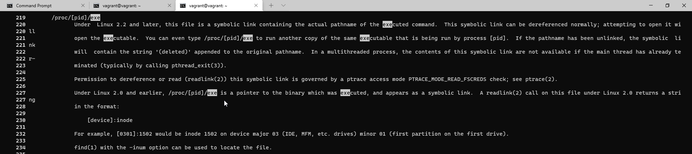  
   
1. Версия 4.2.  
   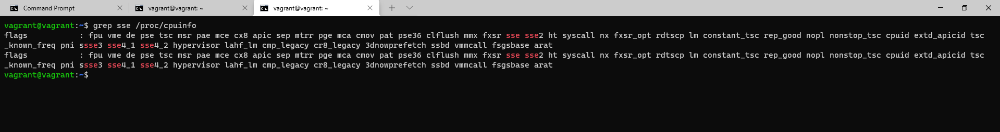  
   
1. Так происходит потому что по-умолчанию, при запуске команды на удаленном компьютере с помощью ssh, TTY не выделяется для удаленного сеанса.  
   Для того чтобы изменить поведение нужно добавить `-t`. Получится команда `ssh -t localhost 'tty'`.  
   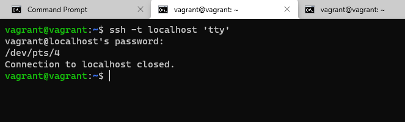  

1. При запуске команды `reptyr PID` выдал ошибку `Operation not permitted`.  
   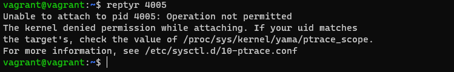  
   
   Под root изменил значение параметра `ptrace_scope` на `0` командой `echo 0 > /proc/sys/kernel/yama/ptrace_scope`.  
   
   Затем перелогинился под пользователем vagrant, запустил команду `top`.  
   
   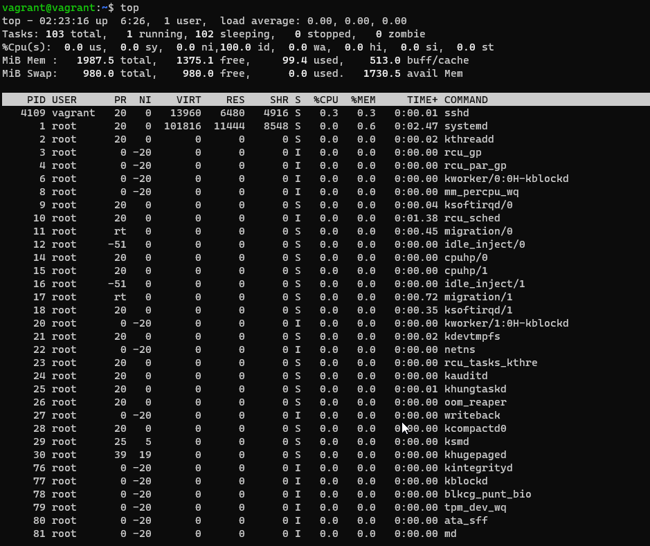  
   
   Отправил процесс `top` в фон, возобновил его в фоновом режиме, посмотрел его PID с помощью команды `jobs -l`, убрал процесс из списка задач с помощью команды `disown top`, при этом в списке процессов он по прежнеу отображается (`ps -a`).  
   
   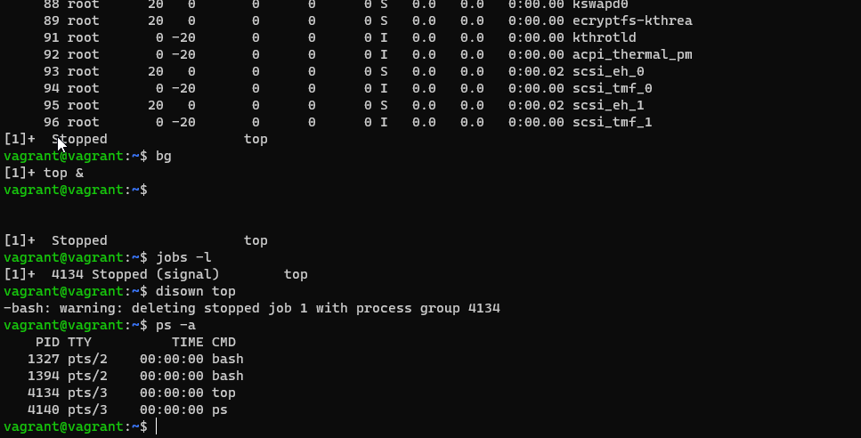  
   
   Запустил ещё одну терминальную сессию, и выполнил в нёй команду `reptyr 4134`.  
   
   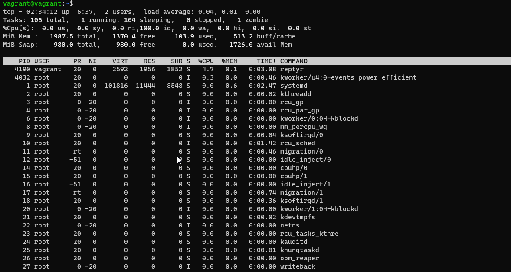  
   
   Закрыл первую терминальную сессию, во второй процесс продолжает выполнятся.  
   
   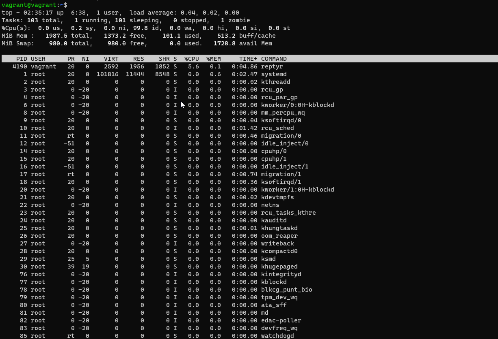  
   
1. Команда `tee` считывает `stdin` и записывает его одновременно и в `stdout` и в файл. Команда `echo string | sudo tee /root/new_file` получает вывод из `stdin`, перенаправленный через pipe из `stdout` команды `echo string`, и команда `tee` запущена от sudo поэтому эта конструкция  работает.  
   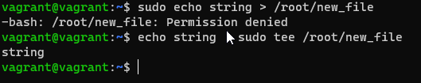