# Домашнее задание к занятию "3.5. Файловые системы"  
  
1. Изучил. Может применятся для экономии дискового пространства при резервном копировании, хранении образов дисков виртуальных машин. Но может привести к большой фрагментации файловой системы.  
   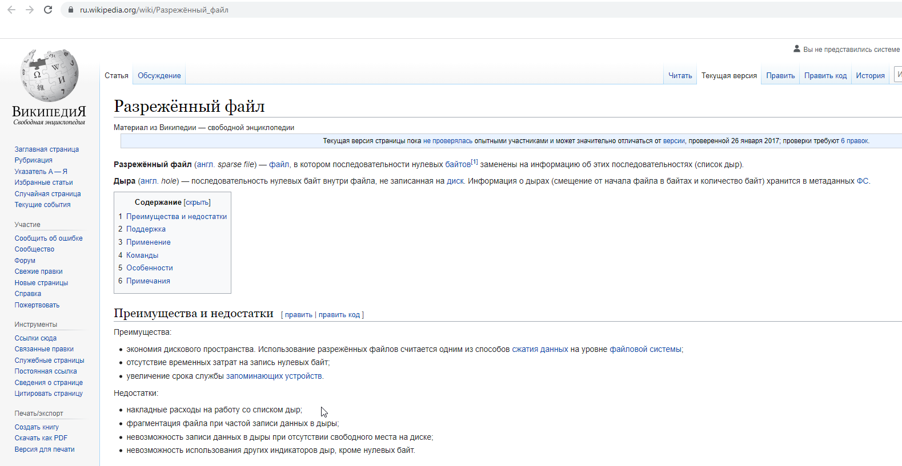  
   
1. Не могут, не смотря на то что жесткая ссылка это отдельный файл, он имеет тот же inode и набор разрешений что и у исходного файла.  
   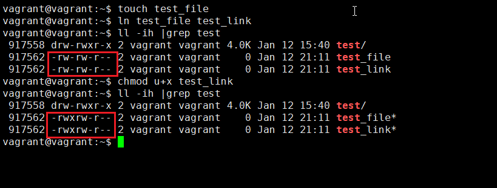     
   
1. Выполнил `vagrant destroy`  
   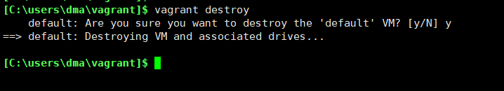  
   
   Заменил содержимое в Vagrantfile.  
   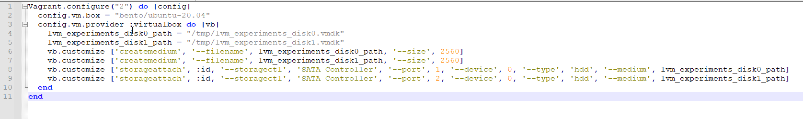  
   
   Запустил виртуалку.  
   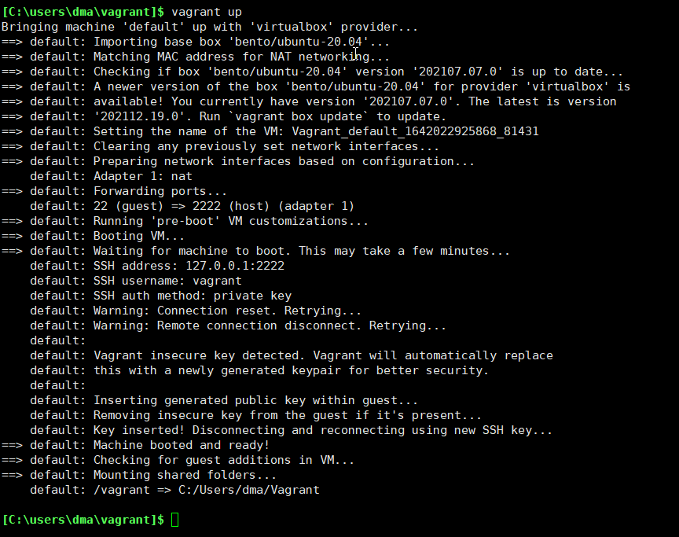  
   
   Вывод lsblk:  
   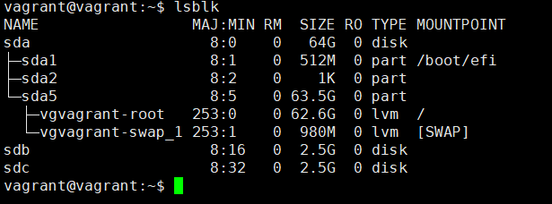  
   
1. Выполнил.  
   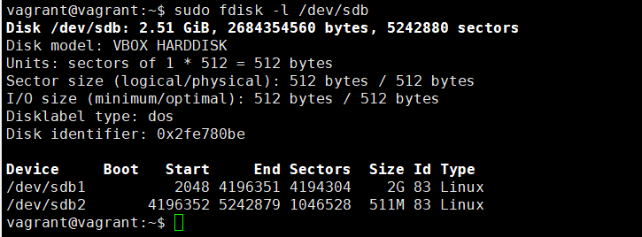  
   
1. Выполнил.  
   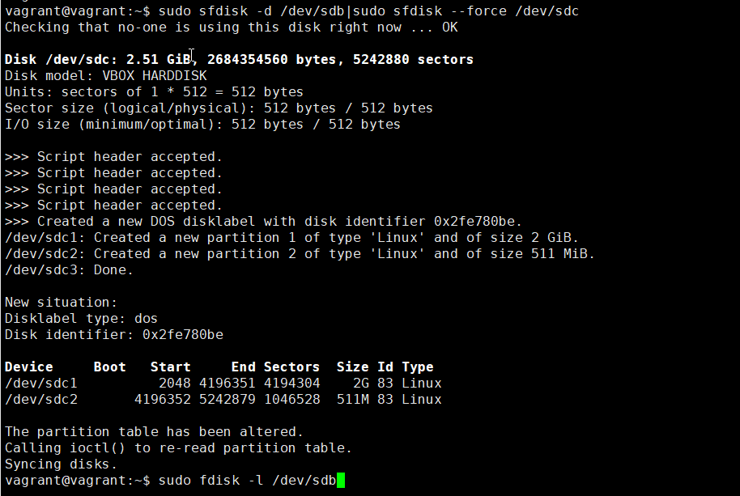  
   
   Вывод fdisk -l:  
   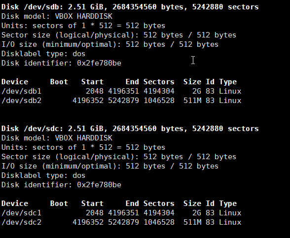  
   
   Вывод lsblk:  
   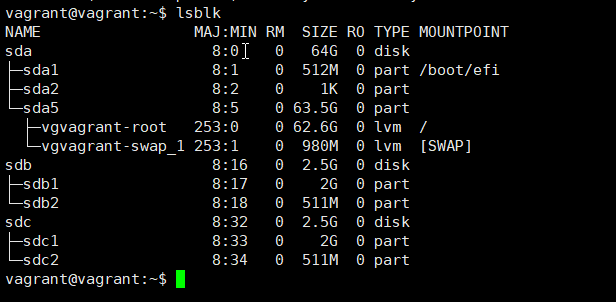  
   
1. Выполнено.  
   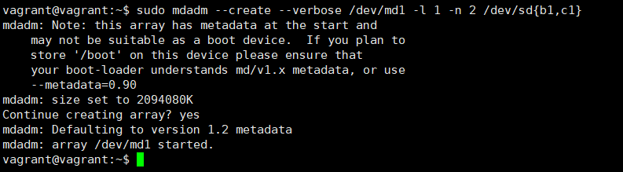  
   
   Вывод lsblk:  
   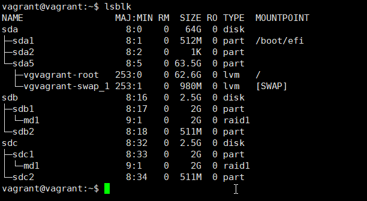  
   
1. Выполнено.  
   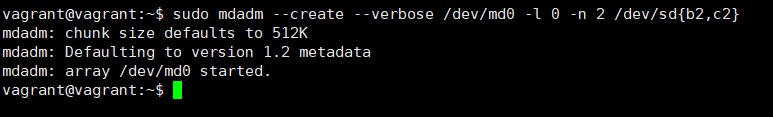  
   
   Вывод lsblk:  
   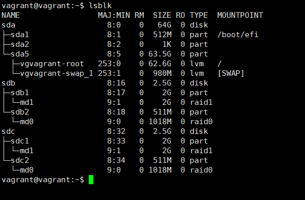  
   
1. Выполнено.  
   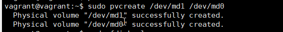  
   
   Вывод pvs:  
   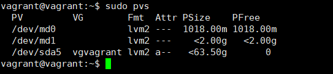  
   
1. Выполнено.  
   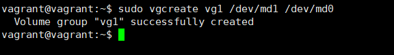  
   
   Вывод vgdisplay:  
   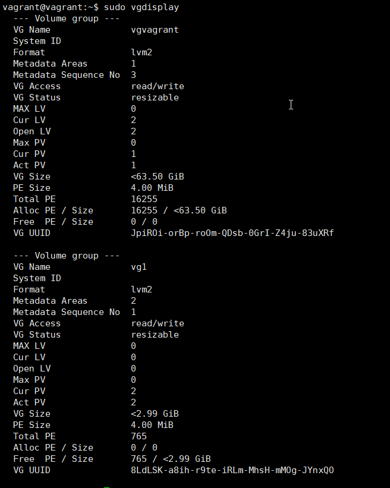  
   
1. Выполнено.  
   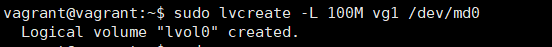  
   
   Вывод lvs:  
   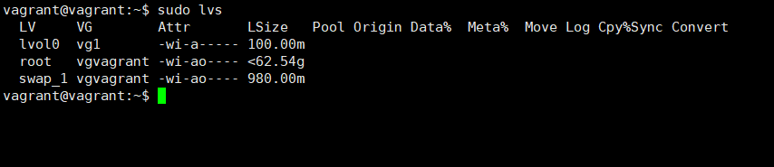  
   
1. Выполнено.  
   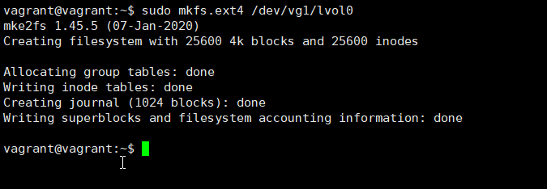  
   
1. Выполнено.  
   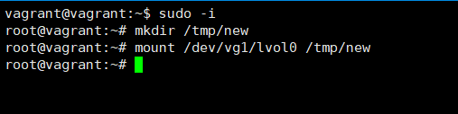  
   
1. Выполнено.  
   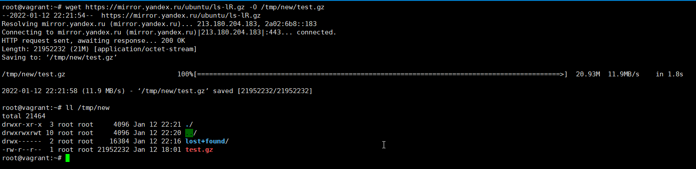  
   
1. Вывод lsblk:  
   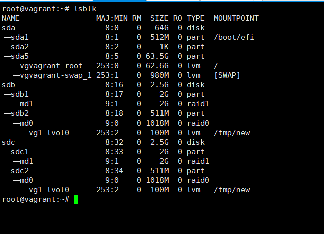  
   
1. Выполнено.  
   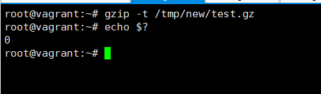  
   
1. Выполнено.  
   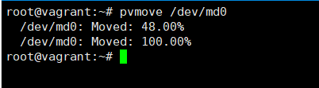  
   
   Вывод lsblk:  
   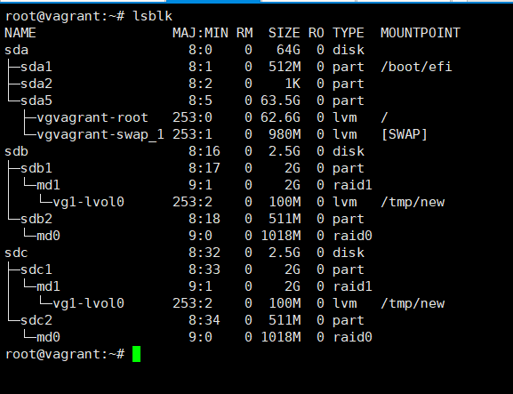  
   
1. Выполнено.  
   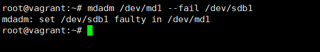  
   
   Вывод mdadm -D:  
   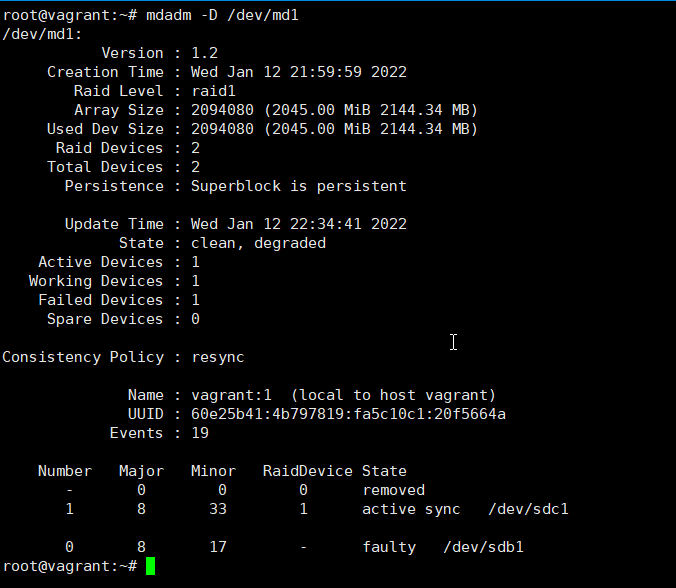  
   
1. Выполнено.  
   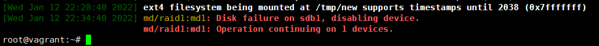  
   
1. Выполнено.  
   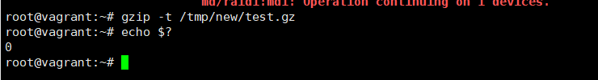  
   
1. Выполнено.  
   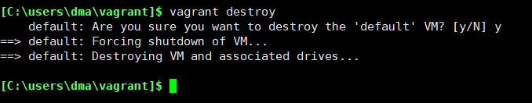  