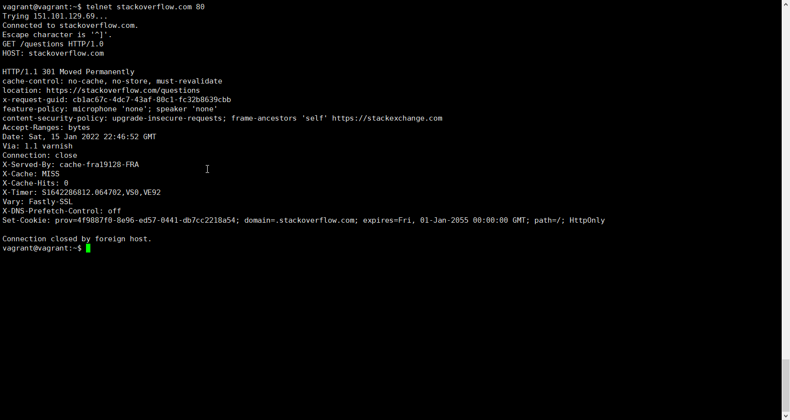
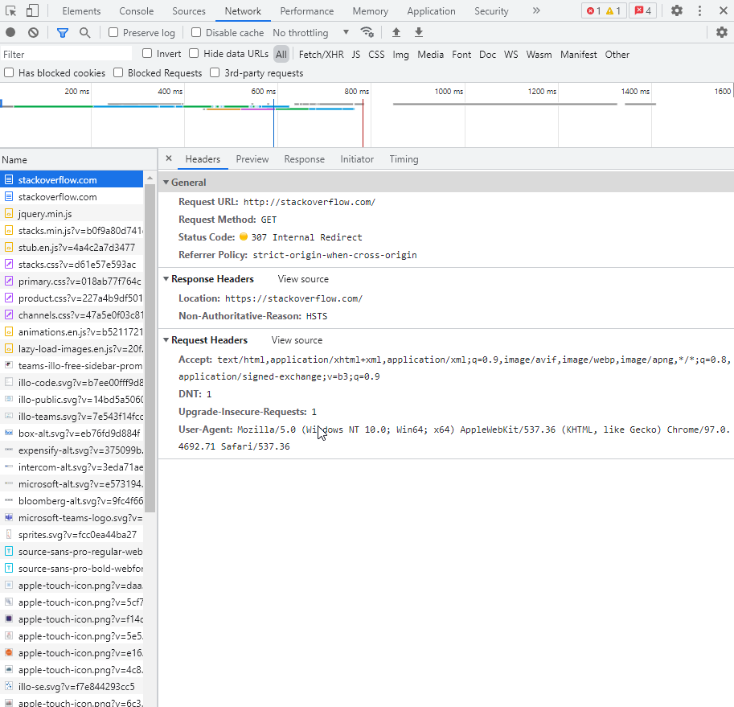
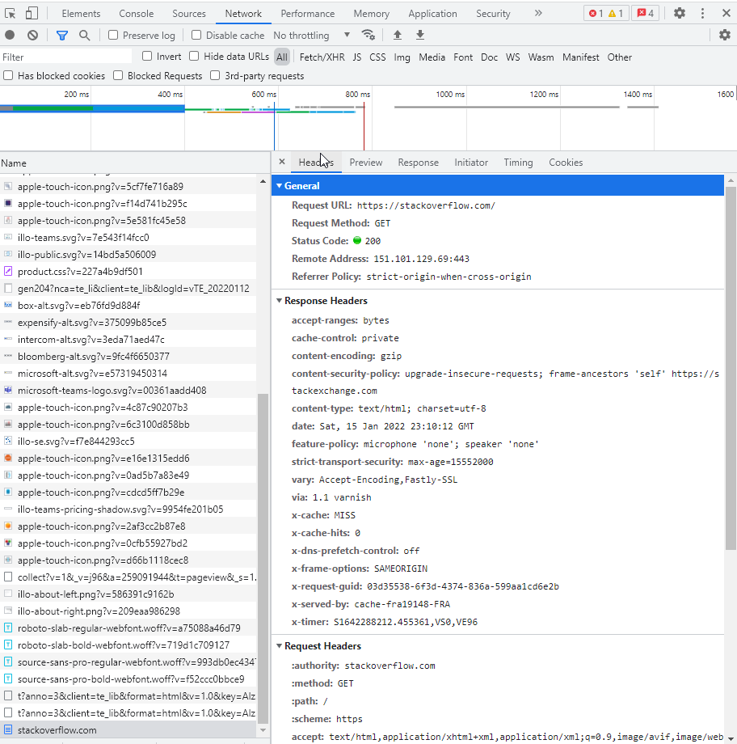
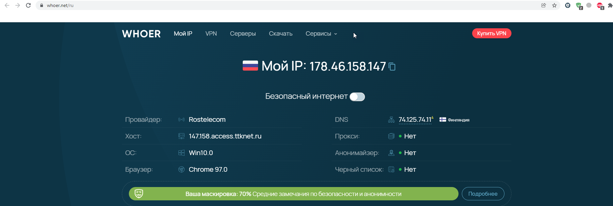
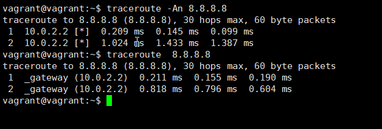
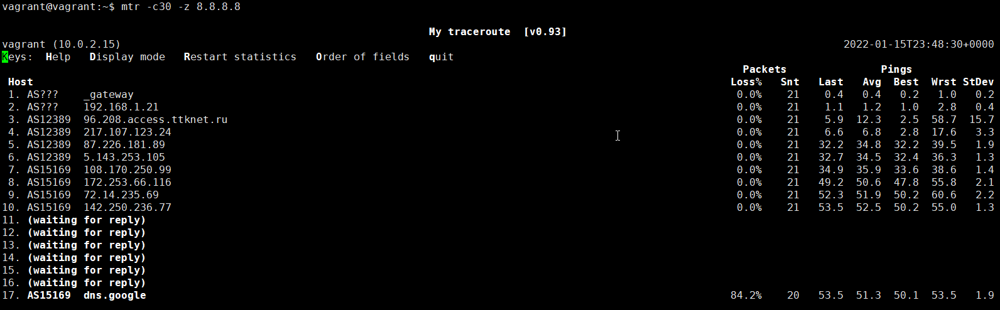
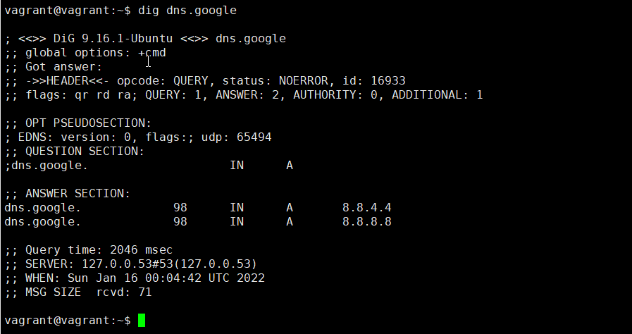
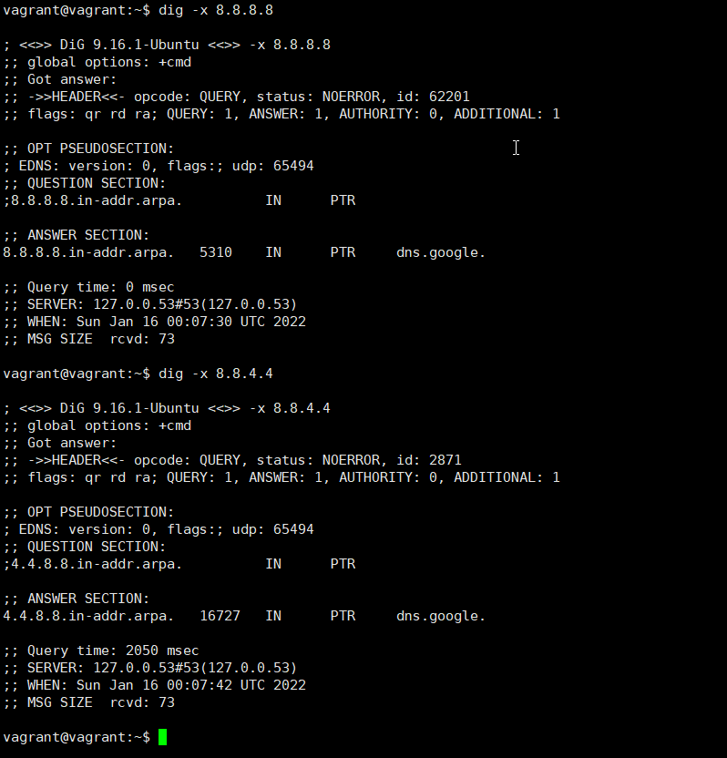

# Домашнее задание к занятию "3.6. Компьютерные сети (лекция 1)"  
  
1. Выполнил. Код `HTTP/1.1 301 Moved Permanently` показывает, что запрошенный ресурс был окончательно перемещён в `location: https://stackoverflow.com/questions`.  
     
   
   Для того чтобы просмотреть содержимое `https://stackoverflow.com/questions` необходимо использовать openssl вместо telnet.  
   
1. Выполнил.  `307 Internal Redirect`.  
     

   Самый долгий запрос выполнялся 390,67 ms.  
     
   
1. Выполнил.  
     

1. Выполнил.  
   Провайдер `Rostelecom networks`, автономная система `AS12389`
     
   
1. На виртуалке не получилось выполнить `traceroute -An 8.8.8.8`.  
     
   Воспользовался утилитой mtr.  
     

1. Выполнил.  Самая большая задержка на участке 142.250.236.77.  
     
   
1. Выполнил.  
     
   
1. Выполнил. Доменное имя `dns.google`.  
     
