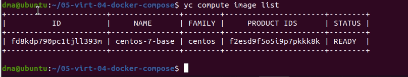
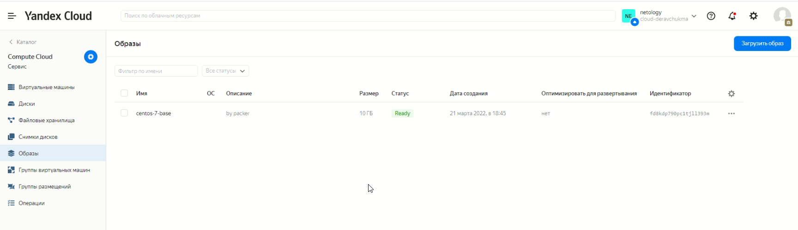
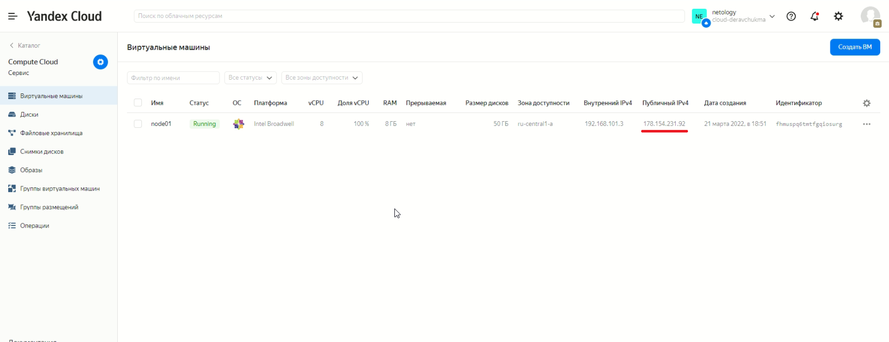
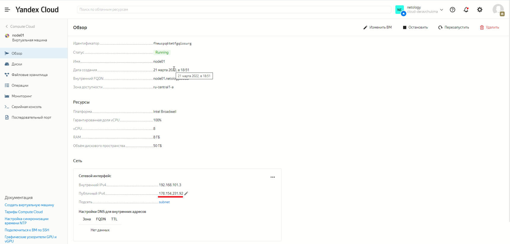
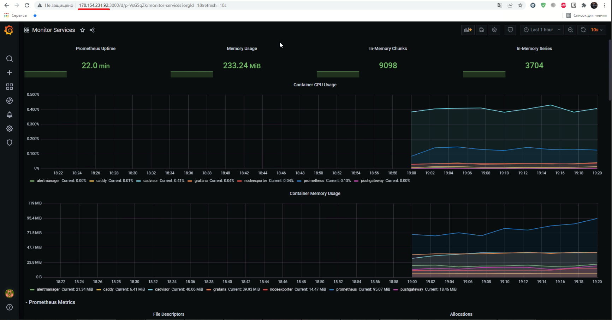
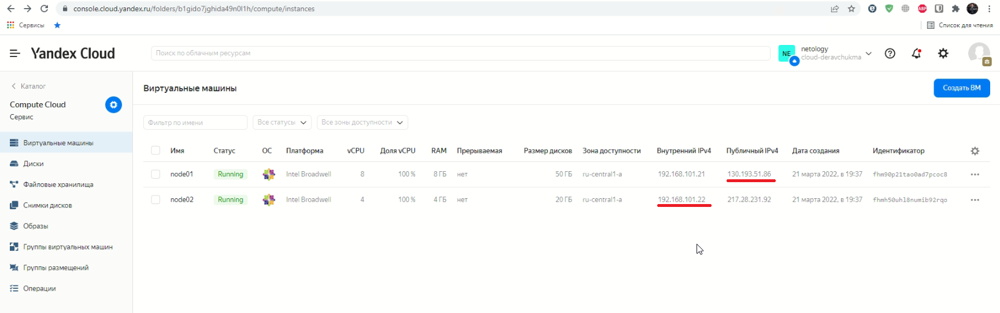
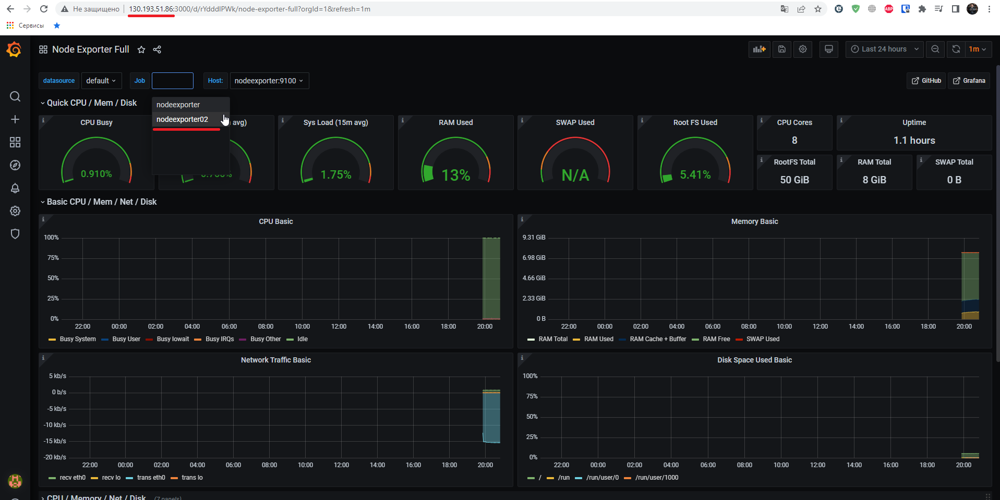
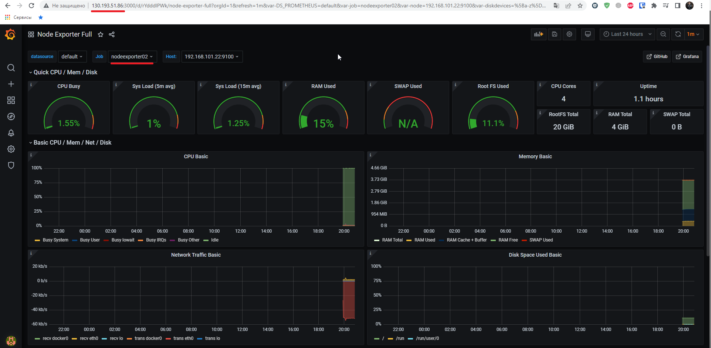

# Домашнее задание к занятию "5.4. Оркестрация группой Docker контейнеров на примере Docker Compose"

1.  
  

  

2.  
  
  

3.  
  

4.  
После перезапуска у первой ноды сменился ip на `130.193.51.86`
  

В дашбордах установленных по-умолчанию вторая нода не отображалась. Установил дашборд `Node Exporter Full`, в нём отображаются обе ноды.  
  
  