# Домашнее задание к занятию "6.3. MySQL"

1.  
Используя docker поднимите инстанс MySQL (версию 8). Данные БД сохраните в volume.  
  
`docker pull mysql:8.0`  
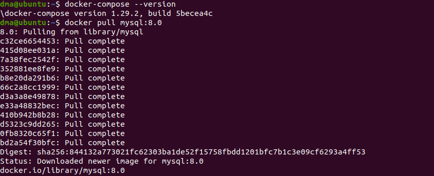  
  
mysql.yml:  
```
version: '3.7'

services:

  db:
    image: mysql:8.0
    restart: always
    container_name: mysql
    environment:
      MYSQL_DATABASE: 'test_db'
      MYSQL_USER: 'mysql'
      MYSQL_PASSWORD: 'mysql'
      MYSQL_ROOT_PASSWORD: 'root'
    volumes:
      - /home/dma/06-db-03-mysql/data:/var/lib/mysql
      - /home/dma/06-db-03-mysql/backup:/backup
    ports:
      - '3306:3306'
  adminer:
    image: adminer
    restart: always
    environment:
      ADMINER_DEFAULT_SERVER: db      
    ports:
      - '8080:8080'

```  
  
```
cd 06-db-03-mysql/
docker-compose -f mysql.yml up -d
```  
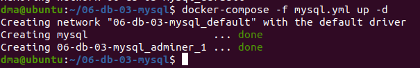  
  
Изучите [бэкап БД](https://github.com/netology-code/virt-homeworks/tree/master/06-db-03-mysql/test_data) и восстановитесь из него.  
  
`docker exec -it mysql bash`  
  
  
  
`mysql -u root -p test_db < /backup/test_dump.sql`  
  
  
  
Перейдите в управляющую консоль `mysql` внутри контейнера. 
  
`mysql -u root -p test_db`  
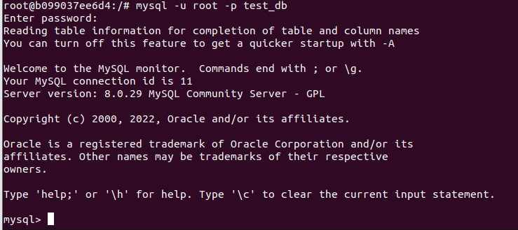  
  
Используя команду `\h` получите список управляющих команд.  
  
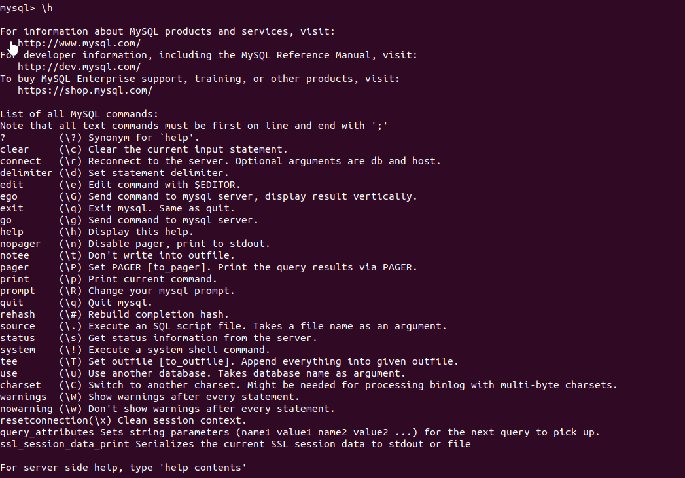  
  
Найдите команду для выдачи статуса БД и **приведите в ответе** из ее вывода версию сервера БД.  
  
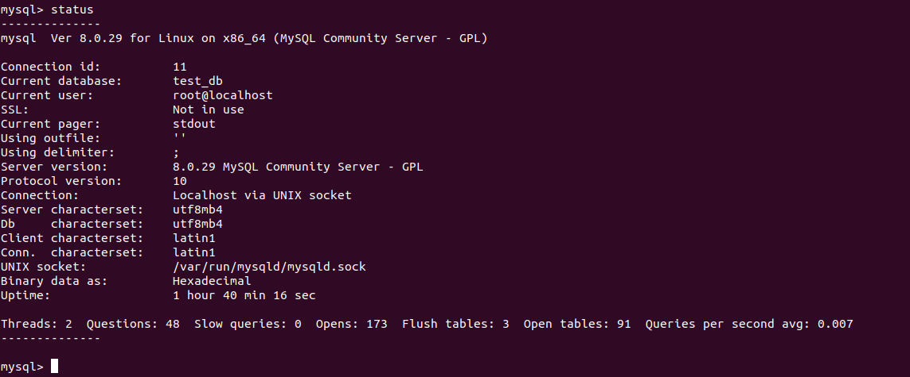  
  
Подключитесь к восстановленной БД и получите список таблиц из этой БД.  
`SHOW TABLES;`  
  
  
**Приведите в ответе** количество записей с `price` > 300.  
  
`select count(*) from orders o where o.price >300;`  
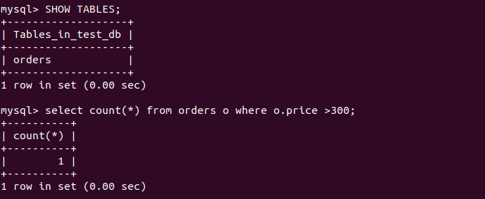  
  
В следующих заданиях мы будем продолжать работу с данным контейнером.  
  
2.  
  
Создайте пользователя test в БД c паролем test-pass, используя:  
  
```
CREATE USER 'test'@'localhost'
IDENTIFIED WITH mysql_native_password BY 'test-pass'
WITH MAX_QUERIES_PER_HOUR 100
PASSWORD EXPIRE INTERVAL 180 DAY
FAILED_LOGIN_ATTEMPTS 3 PASSWORD_LOCK_TIME 1
ATTRIBUTE '{"last_name": "Pretty", "first_name": "James"}';
```  
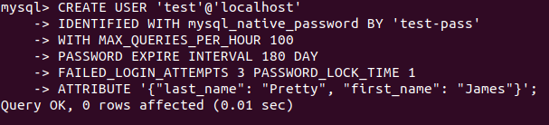  
  
Предоставьте привелегии пользователю `test` на операции SELECT базы `test_db`.  
  
`grant select on test_db.* to 'test'@'localhost';`
  
  
Используя таблицу INFORMATION_SCHEMA.USER_ATTRIBUTES получите данные по пользователю `test` и **приведите в ответе к задаче**.  
  
`select * from INFORMATION_SCHEMA.USER_ATTRIBUTES where user='test';`
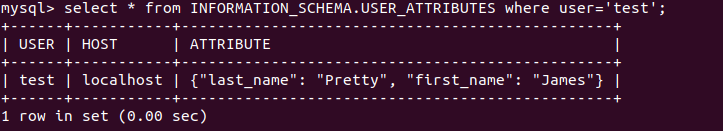  
  
3.  

Установите профилирование `SET profiling = 1`.  
  
  
  
Изучите вывод профилирования команд `SHOW PROFILES;`.  
  
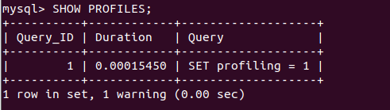  
  
Исследуйте, какой `engine` используется в таблице БД `test_db` и **приведите в ответе**.  
  
`SELECT TABLE_SCHEMA, TABLE_NAME, ENGINE FROM information_schema.TABLES WHERE TABLE_SCHEMA = 'test_db';`  
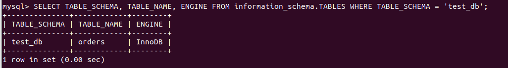  
  
Измените `engine` и **приведите время выполнения и запрос на изменения из профайлера в ответе**:  
- на `MyISAM`  
  
```ALTER TABLE orders ENGINE = MyISAM;
select * from orders;
SHOW PROFILES;
```  
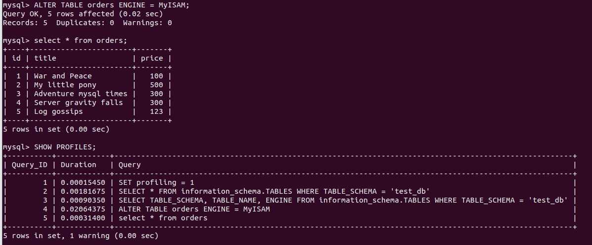  
  
- на `InnoDB`  
```ALTER TABLE orders ENGINE = InnoDB;
select * from orders;
SHOW PROFILES;
```  
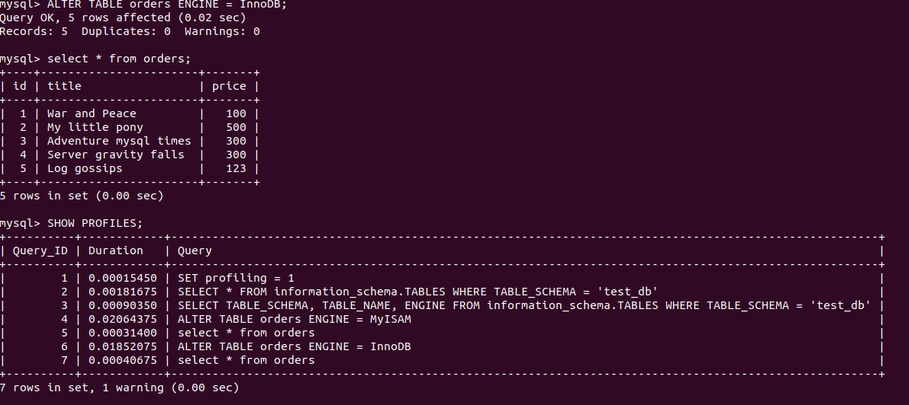  
  
4.  
  
Изучите файл `my.cnf` в директории /etc/mysql.  

`cat /etc/mysql/my.cnf`  
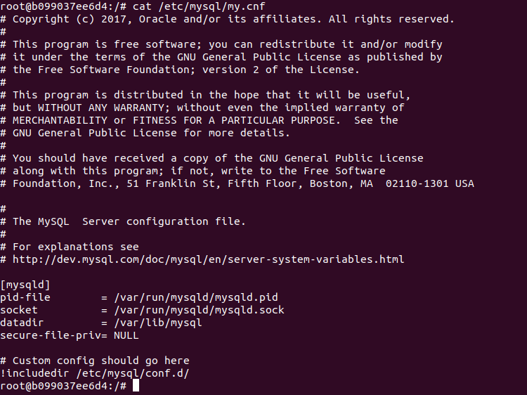  
  
Измените его согласно ТЗ (движок InnoDB):  
- Скорость IO важнее сохранности данных  
- Нужна компрессия таблиц для экономии места на диске  
- Размер буффера с незакомиченными транзакциями 1 Мб  
- Буффер кеширования 30% от ОЗУ  
- Размер файла логов операций 100 Мб  
  
Приведите в ответе измененный файл `my.cnf`.  
  
```
[mysqld]
pid-file        = /var/run/mysqld/mysqld.pid
socket          = /var/run/mysqld/mysqld.sock
datadir         = /var/lib/mysql
secure-file-priv= NULL

# Скорость IO важнее сохранности данных
innodb_flush_log_at_trx_commit = 2

# Нужна компрессия таблиц для экономии места на диске
innodb_file_per_table = 1

# Размер буффера с незакомиченными транзакциями 1 Мб
innodb_log_buffer_size = 1M

# Буффер кеширования 30% от ОЗУ. Для сервера с 4096 Mb будет = 1228.
innodb_buffer_pool_size = 1228M

# Размер файла логов операций 100 Мб
innodb_log_file_size = 100M

# Custom config should go here
!includedir /etc/mysql/conf.d/
```  
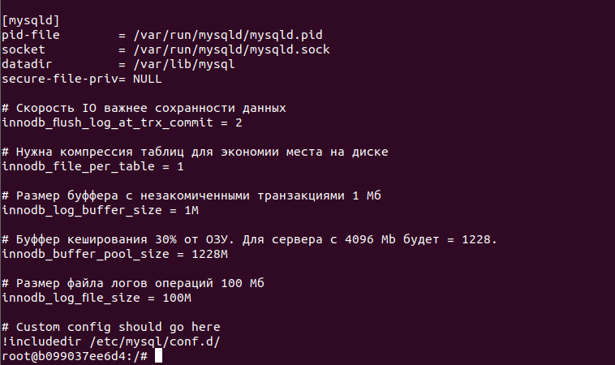  