# Домашнее задание к занятию "3.9. Элементы безопасности информационных систем"  
  
1. Выполнено.  
     
   
     
   
1. Выполнено.  
   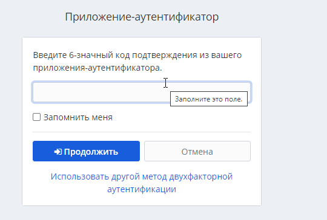  
   
   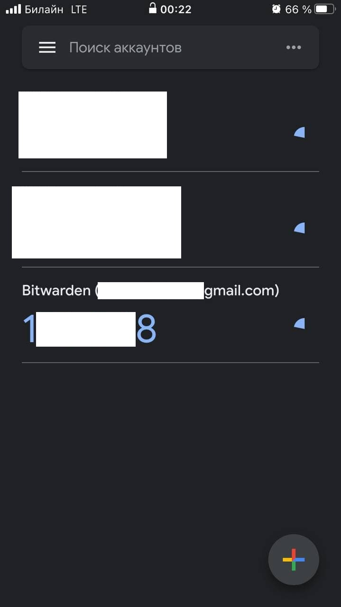  

1. Установил apache2.  
   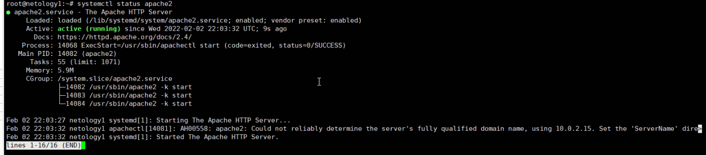  
   
   Сгенерировал сертификат.  
     
   
   Создал файл конфигурации тестового сайта.  
   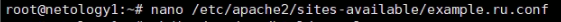  
   
   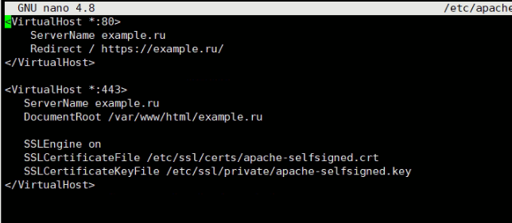  
   
   Создал директорию  тестового сайта.  
     
   
   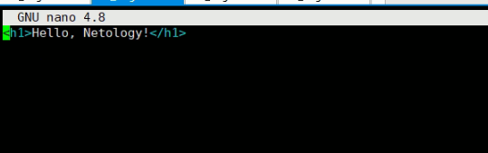  
   
   Перезапустил тестовый сайт.  
     
   
   Протестировал сайт.  
   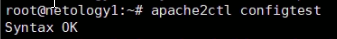  
   
   Открыл сайт на хосте.  
   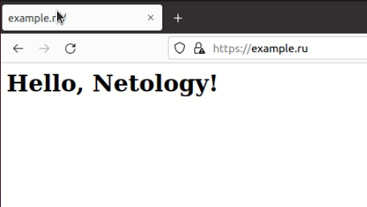  
   
   Проверил сертификат.  
   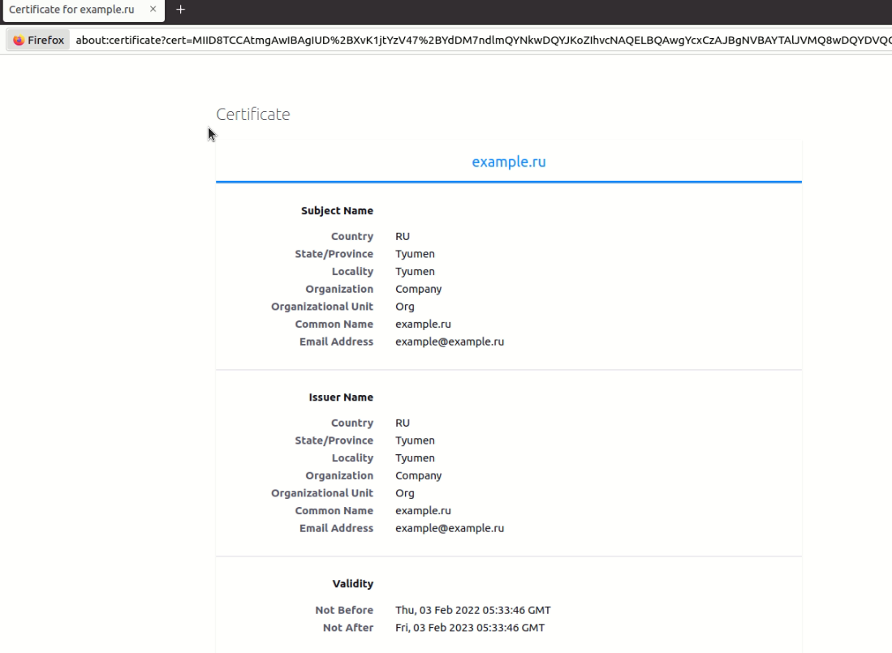  

1. Проверил на уязвимости сайт medinfocenter.ru  
   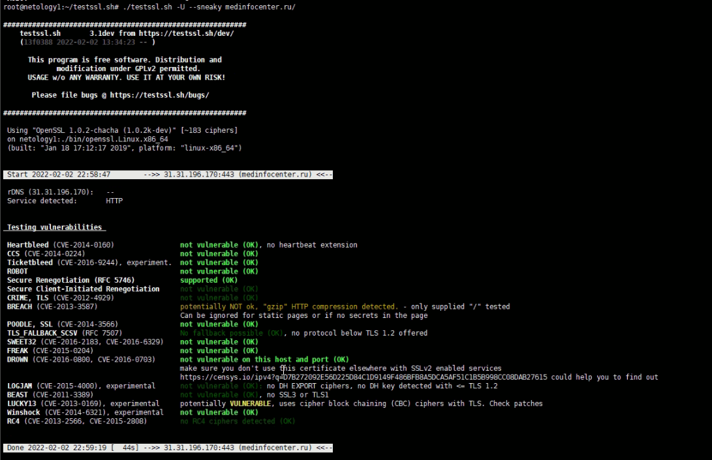  
   
1. Проверил службу ssh.  
   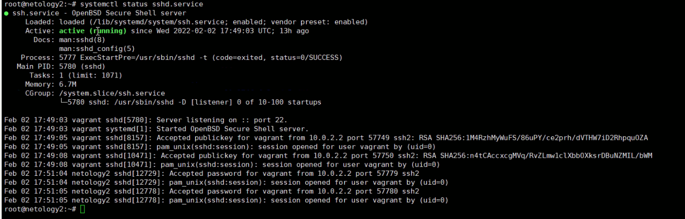  
   
   Сгенерировал ключи.  
   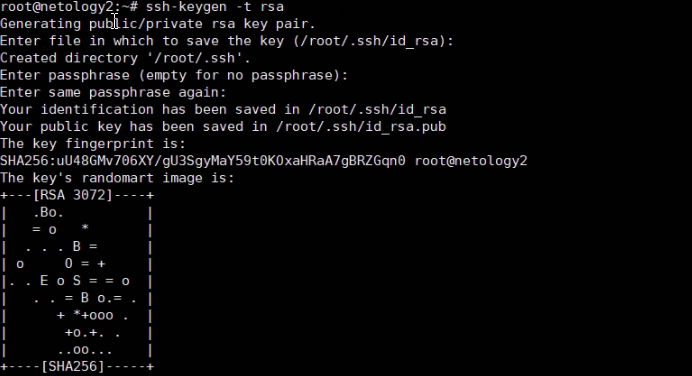  
   
   Скопировал свой публичный ключ на другой сервер.  
   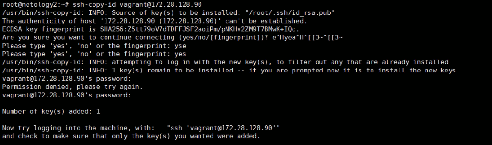  
   
   Подключился к другому серверу по SSH-ключу.  
     
   
1. Переименовал ключи.  
   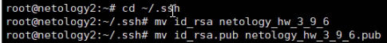  
   
   Скопировал свой публичный ключ на другой сервер.  
   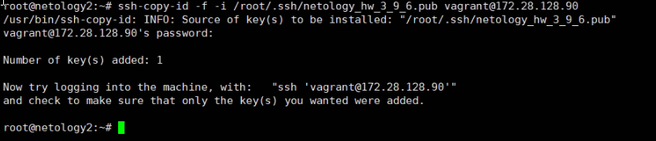  
   
   Настроил файл конфигурации SSH клиента.  
   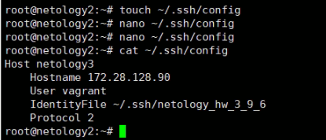  
   
   Подключился к другому серверу по имени сервера.  
   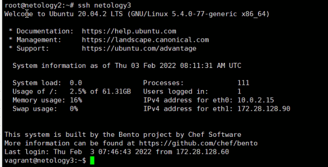  
   
1. Собрал дамп с порта eth0.  
   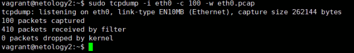  
   
   Открыл файл pcap в Wireshark.  
   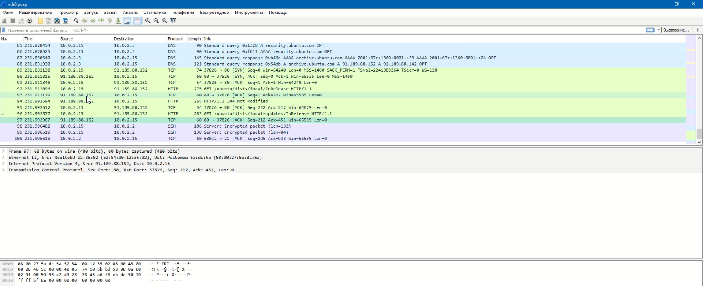  
   
1. Просканировал. Запущены: ssh (22), web-сервер (80), сервер nping-echo (9929), и какой-то троян Elite (31337).  
   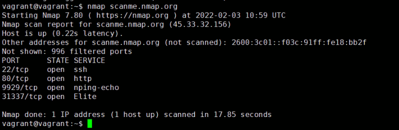  
   
1. Установил и настроил.  
   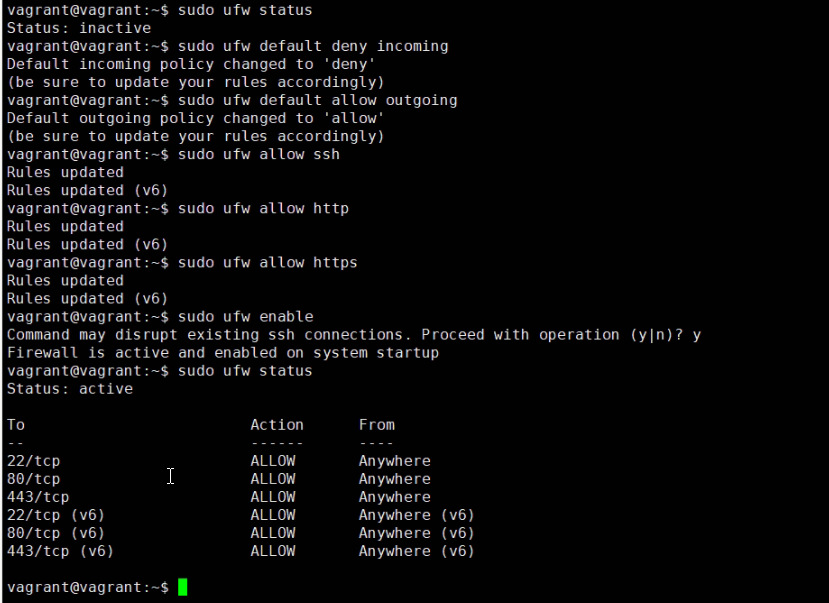  