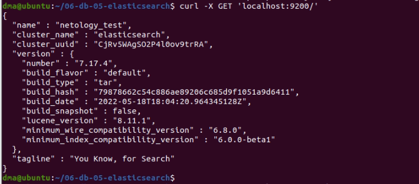
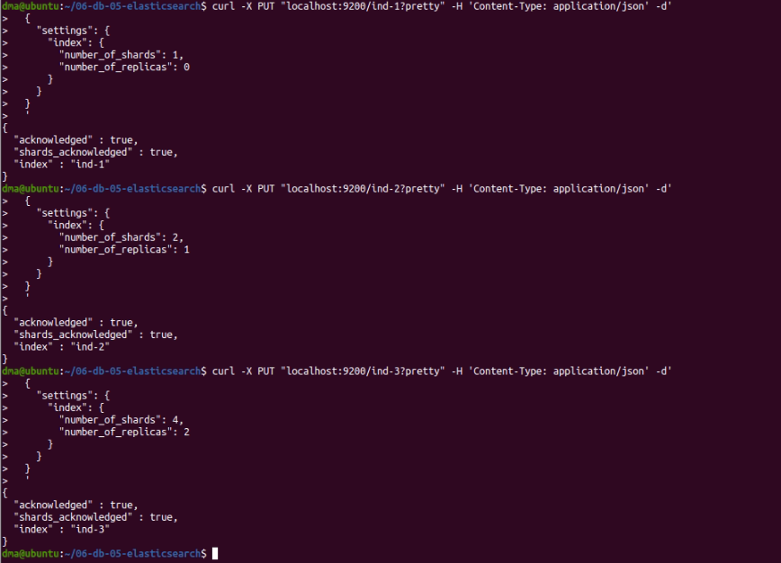
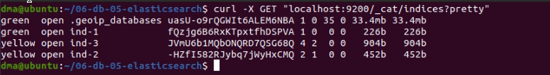
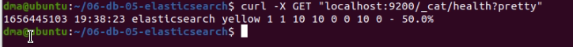
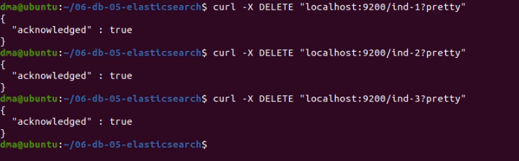
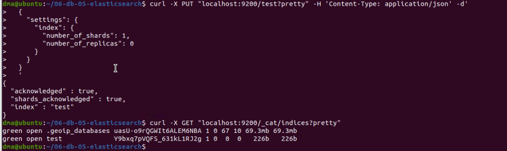
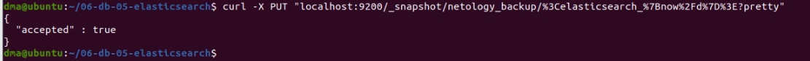
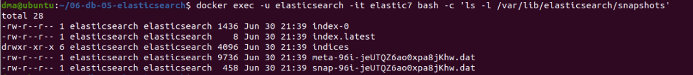
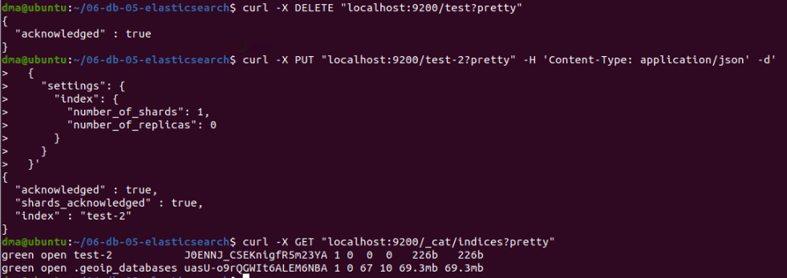
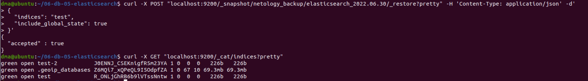

# Домашнее задание к занятию "6.5. Elasticsearch"

## Задача 1

В этом задании вы потренируетесь в:
- установке elasticsearch
- первоначальном конфигурировании elastcisearch
- запуске elasticsearch в docker

Используя докер образ [centos:7](https://hub.docker.com/_/centos) как базовый и 
[документацию по установке и запуску Elastcisearch](https://www.elastic.co/guide/en/elasticsearch/reference/current/targz.html):

- составьте Dockerfile-манифест для elasticsearch
- соберите docker-образ и сделайте `push` в ваш docker.io репозиторий
- запустите контейнер из получившегося образа и выполните запрос пути `/` c хост-машины

Требования к `elasticsearch.yml`:
- данные `path` должны сохраняться в `/var/lib`
- имя ноды должно быть `netology_test`
  
[elasticsearch.yml](elasticsearch.yml)  
  
```
node.name: netology_test
path.data: /var/lib/elasticsearch/data
path.logs: /var/lib/elasticsearch/logs
network.host: 0.0.0.0
discovery.type: single-node
```
  
В ответе приведите:
- текст Dockerfile манифеста
    
[Dockerfile](elasticsearch.yml)  
  
```
FROM centos:7

ENV ES_HOME=/elasticsearch \
    ES_PATH_DATA_LOGS=/var/lib/elasticsearch \
    ES_VERSION=7.17.4 \
    ES_USER=elasticsearch

RUN yum -y install wget && \
    yum install perl-Digest-SHA -y && \
    wget https://artifacts.elastic.co/downloads/elasticsearch/elasticsearch-${ES_VERSION}-linux-x86_64.tar.gz && \
    wget https://artifacts.elastic.co/downloads/elasticsearch/elasticsearch-${ES_VERSION}-linux-x86_64.tar.gz.sha512 && \
    sha512sum -c elasticsearch-${ES_VERSION}-linux-x86_64.tar.gz.sha512 && \
    tar -xzf elasticsearch-${ES_VERSION}-linux-x86_64.tar.gz && \
	rm -rf elasticsearch-${ES_VERSION}-linux-x86_64.tar.gz && \
	rm -rf elasticsearch-${ES_VERSION}-linux-x86_64.tar.gz.sha512 && \
    mv /elasticsearch-${ES_VERSION} ${ES_HOME} && \
    mkdir -p ${ES_PATH_DATA_LOGS}/{data,logs} && \
    adduser ${ES_USER} && \
    chown -R ${ES_USER}:${ES_USER} ${ES_HOME} ${ES_PATH_DATA_LOGS} && \
    yum erase -y wget && \
	yum erase -y perl-Digest-SHA && \
    yum clean all

COPY --chown=${ES_USER}:${ES_USER} elasticsearch.yml ${ES_HOME}/config

EXPOSE 9200
EXPOSE 9300

USER ${ES_USER}
WORKDIR ${ES_HOME}

CMD ["sh", "-c", "${ES_HOME}/bin/elasticsearch"]
```
- ссылку на образ в репозитории dockerhub  
  
[Ссылка на образ](https://hub.docker.com/layers/elasticsearch/deravchukma/elasticsearch/7.17.4/images/sha256-4aaeb86a6ce121a14d1895340ecee3afddb293ff8509b13c459b57d5a117b0ab?context=repo)  

- ответ `elasticsearch` на запрос пути `/` в json виде
  
```
{
  "name" : "netology_test",
  "cluster_name" : "elasticsearch",
  "cluster_uuid" : "CjRv5WAgSO2P4l0ov9trRA",
  "version" : {
    "number" : "7.17.4",
    "build_flavor" : "default",
    "build_type" : "tar",
    "build_hash" : "79878662c54c886ae89206c685d9f1051a9d6411",
    "build_date" : "2022-05-18T18:04:20.964345128Z",
    "build_snapshot" : false,
    "lucene_version" : "8.11.1",
    "minimum_wire_compatibility_version" : "6.8.0",
    "minimum_index_compatibility_version" : "6.0.0-beta1"
  },
  "tagline" : "You Know, for Search"
}
```
  
  
  
Подсказки:
- возможно вам понадобится установка пакета perl-Digest-SHA для корректной работы пакета shasum
- при сетевых проблемах внимательно изучите кластерные и сетевые настройки в elasticsearch.yml
- при некоторых проблемах вам поможет docker директива ulimit
- elasticsearch в логах обычно описывает проблему и пути ее решения

Далее мы будем работать с данным экземпляром elasticsearch.

## Задача 2

В этом задании вы научитесь:
- создавать и удалять индексы
- изучать состояние кластера
- обосновывать причину деградации доступности данных

Ознакомтесь с [документацией](https://www.elastic.co/guide/en/elasticsearch/reference/current/indices-create-index.html) 
и добавьте в `elasticsearch` 3 индекса, в соответствии со таблицей:

| Имя | Количество реплик | Количество шард |
|-----|-------------------|-----------------|
| ind-1| 0 | 1 |
| ind-2 | 1 | 2 |
| ind-3 | 2 | 4 |
  
```
dma@ubuntu:~/06-db-05-elasticsearch$ curl -X PUT "localhost:9200/ind-1?pretty" -H 'Content-Type: application/json' -d'
>   {
>     "settings": {
>       "index": {
>         "number_of_shards": 1,  
>         "number_of_replicas": 0 
>       }
>     }
>   }
>   '
{
  "acknowledged" : true,
  "shards_acknowledged" : true,
  "index" : "ind-1"
}
dma@ubuntu:~/06-db-05-elasticsearch$ curl -X PUT "localhost:9200/ind-2?pretty" -H 'Content-Type: application/json' -d'
>   {
>     "settings": {
>       "index": {
>         "number_of_shards": 2,  
>         "number_of_replicas": 1 
>       }
>     }
>   }
>   '
{
  "acknowledged" : true,
  "shards_acknowledged" : true,
  "index" : "ind-2"
}
dma@ubuntu:~/06-db-05-elasticsearch$ curl -X PUT "localhost:9200/ind-3?pretty" -H 'Content-Type: application/json' -d'
>   {
>     "settings": {
>       "index": {
>         "number_of_shards": 4,  
>         "number_of_replicas": 2 
>       }
>     }
>   }
>   '
{
  "acknowledged" : true,
  "shards_acknowledged" : true,
  "index" : "ind-3"
}
```
  
  

Получите список индексов и их статусов, используя API и **приведите в ответе** на задание.  
  
```
dma@ubuntu:~/06-db-05-elasticsearch$ curl -X GET "localhost:9200/_cat/indices?pretty"
green  open .geoip_databases uasU-o9rQGWIt6ALEM6NBA 1 0 35 0 33.4mb 33.4mb
green  open ind-1            fQzjg6B6RxKTpxtfhDSPVA 1 0  0 0   226b   226b
yellow open ind-3            JVmU6b1MQbONQRD7QSG68Q 4 2  0 0   904b   904b
yellow open ind-2            -HZfI582RJybq7jWyHxCMQ 2 1  0 0   452b   452b
```
  
  
  
Получите состояние кластера `elasticsearch`, используя API.  
  
```
dma@ubuntu:~/06-db-05-elasticsearch$ curl -X GET "localhost:9200/_cat/health?pretty"
1656445103 19:38:23 elasticsearch yellow 1 1 10 10 0 0 10 0 - 50.0%
```
  
  
  
Как вы думаете, почему часть индексов и кластер находится в состоянии yellow?  
  
*Потому что у второго и третьего индекса должно быть несколько реплик, но у нас всего одна нода, и их некуда реплицировать.*  
  
Удалите все индексы.  
  
```
dma@ubuntu:~/06-db-05-elasticsearch$ curl -X DELETE "localhost:9200/ind-1?pretty"
{
  "acknowledged" : true
}
dma@ubuntu:~/06-db-05-elasticsearch$ curl -X DELETE "localhost:9200/ind-2?pretty"
{
  "acknowledged" : true
}
dma@ubuntu:~/06-db-05-elasticsearch$ curl -X DELETE "localhost:9200/ind-3?pretty"
{
  "acknowledged" : true
}
```
  
  
  
**Важно**

При проектировании кластера elasticsearch нужно корректно рассчитывать количество реплик и шард,
иначе возможна потеря данных индексов, вплоть до полной, при деградации системы.

## Задача 3

В данном задании вы научитесь:
- создавать бэкапы данных
- восстанавливать индексы из бэкапов

Создайте директорию `{путь до корневой директории с elasticsearch в образе}/snapshots`.  
  
```
dma@ubuntu:~/06-db-05-elasticsearch$ docker exec -u elasticsearch -it elastic7 bash
[elasticsearch@6aa7ec7390b7 elasticsearch]$ mkdir $ES_HOME/snapshots
[elasticsearch@6aa7ec7390b7 elasticsearch]$ echo path.repo: /var/lib/elasticsearch/snapshots >> "$ES_HOME/config/elasticsearch.yml"
[elasticsearch@6aa7ec7390b7 elasticsearch]$ exit
exit
dma@ubuntu:~/06-db-05-elasticsearch$ docker restart elastic7
elastic7
```
  
Используя API [зарегистрируйте](https://www.elastic.co/guide/en/elasticsearch/reference/current/snapshots-register-repository.html#snapshots-register-repository) 
данную директорию как `snapshot repository` c именем `netology_backup`.  

**Приведите в ответе** запрос API и результат вызова API для создания репозитория.  
  
```
curl -X PUT "localhost:9200/_snapshot/netology_backup?pretty" -H 'Content-Type: application/json' -d'
> {
>   "type": "fs",
>   "settings": {
>     "location": "/var/lib/elasticsearch/snapshots",
>     "compress": true
>   }
> }'
{
  "acknowledged" : true
}
```
  
Создайте индекс `test` с 0 реплик и 1 шардом и **приведите в ответе** список индексов.  
  
```
dma@ubuntu:~/06-db-05-elasticsearch$ curl -X PUT "localhost:9200/test?pretty" -H 'Content-Type: application/json' -d'
>   {
>     "settings": {
>       "index": {
>         "number_of_shards": 1,  
>         "number_of_replicas": 0 
>       }
>     }
>   }
>   '
{
  "acknowledged" : true,
  "shards_acknowledged" : true,
  "index" : "test"
}
dma@ubuntu:~/06-db-05-elasticsearch$ curl -X GET "localhost:9200/_cat/indices?pretty"
green open .geoip_databases uasU-o9rQGWIt6ALEM6NBA 1 0 67 10 69.3mb 69.3mb
green open test             Y9bxq7pVQFS_631kL1RJ2g 1 0  0  0   226b   226b
```
  
  
  
[Создайте `snapshot`](https://www.elastic.co/guide/en/elasticsearch/reference/current/snapshots-take-snapshot.html) 
состояния кластера `elasticsearch`.  
  
```
dma@ubuntu:~/06-db-05-elasticsearch$ curl -X PUT "localhost:9200/_snapshot/netology_backup/%3Celasticsearch_%7Bnow%2Fd%7D%3E?pretty"
{
  "accepted" : true
}
```
  
  
  
**Приведите в ответе** список файлов в директории со `snapshot`ами.  
  
```
dma@ubuntu:~/06-db-05-elasticsearch$ docker exec -u elasticsearch -it elastic7 bash -c 'ls -l /var/lib/elasticsearch/snapshots'
total 28
-rw-r--r-- 1 elasticsearch elasticsearch 1436 Jun 30 21:39 index-0
-rw-r--r-- 1 elasticsearch elasticsearch    8 Jun 30 21:39 index.latest
drwxr-xr-x 6 elasticsearch elasticsearch 4096 Jun 30 21:39 indices
-rw-r--r-- 1 elasticsearch elasticsearch 9736 Jun 30 21:39 meta-96i-jeUTQZ6ao0xpa8jKhw.dat
-rw-r--r-- 1 elasticsearch elasticsearch  458 Jun 30 21:39 snap-96i-jeUTQZ6ao0xpa8jKhw.dat
```
  
  
  
Удалите индекс `test` и создайте индекс `test-2`. **Приведите в ответе** список индексов.  

```
dma@ubuntu:~/06-db-05-elasticsearch$ curl -X DELETE "localhost:9200/test?pretty"
{
  "acknowledged" : true
}
dma@ubuntu:~/06-db-05-elasticsearch$ curl -X PUT "localhost:9200/test-2?pretty" -H 'Content-Type: application/json' -d'
>   {
>     "settings": {
>       "index": {
>         "number_of_shards": 1,  
>         "number_of_replicas": 0 
>       }
>     }
>   }'
{
  "acknowledged" : true,
  "shards_acknowledged" : true,
  "index" : "test-2"
}
dma@ubuntu:~/06-db-05-elasticsearch$ curl -X GET "localhost:9200/_cat/indices?pretty"
green open test-2           J0ENNJ_CSEKnigfR5m23YA 1 0  0  0   226b   226b
green open .geoip_databases uasU-o9rQGWIt6ALEM6NBA 1 0 67 10 69.3mb 69.3mb
```
   
  

[Восстановите](https://www.elastic.co/guide/en/elasticsearch/reference/current/snapshots-restore-snapshot.html) состояние
кластера `elasticsearch` из `snapshot`, созданного ранее. 

**Приведите в ответе** запрос к API восстановления и итоговый список индексов.  
  
```
dma@ubuntu:~/06-db-05-elasticsearch$ curl -X POST "localhost:9200/_snapshot/netology_backup/elasticsearch_2022.06.30/_restore?pretty" -H 'Content-Type: application/json' -d'
> {
>   "indices": "test",
>   "include_global_state": true
> }'
{
  "accepted" : true
}
dma@ubuntu:~/06-db-05-elasticsearch$ curl -X GET "localhost:9200/_cat/indices?pretty"
green open test-2           J0ENNJ_CSEKnigfR5m23YA 1 0  0  0   226b   226b
green open .geoip_databases Z6MQi7_xQPeQL9I5OdpfZA 1 0 67 10 69.3mb 69.3mb
green open test             R_ONLjGhRB6b9lVTssNntw 1 0  0  0   226b   226b
```
  
  
  
Подсказки:
- возможно вам понадобится доработать `elasticsearch.yml` в части директивы `path.repo` и перезапустить `elasticsearch`

---

### Как cдавать задание

Выполненное домашнее задание пришлите ссылкой на .md-файл в вашем репозитории.

---