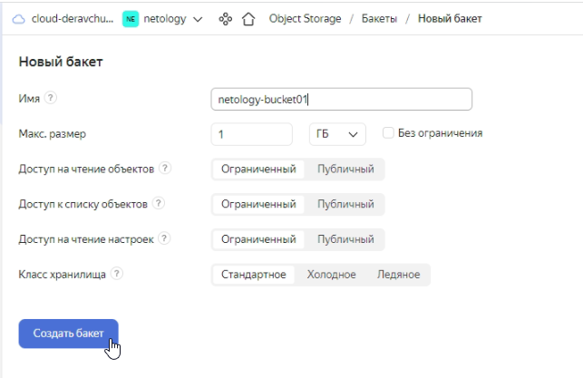
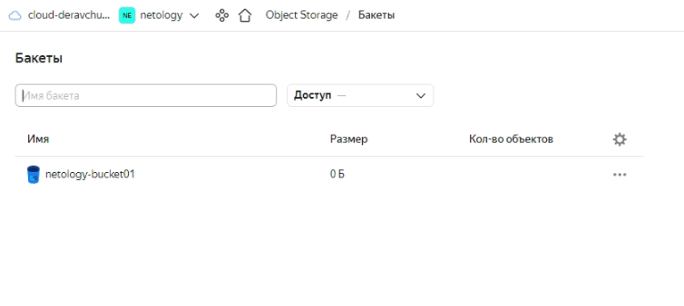
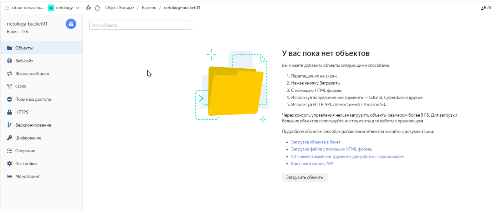
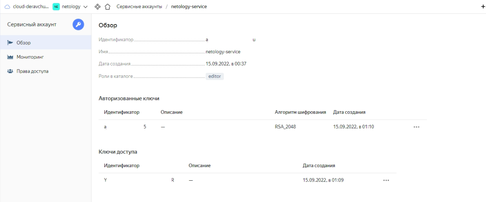

# Домашнее задание к занятию "7.3. Основы и принцип работы Терраформ"

## Задача 1. Создадим бэкэнд в S3 (необязательно, но крайне желательно).

Если в рамках предыдущего задания у вас уже есть аккаунт AWS, то давайте продолжим знакомство со взаимодействием
терраформа и aws. 

1. Создайте s3 бакет, iam роль и пользователя от которого будет работать терраформ. Можно создать отдельного пользователя,
а можно использовать созданного в рамках предыдущего задания, просто добавьте ему необходимы права, как описано 
[здесь](https://www.terraform.io/docs/backends/types/s3.html).  
  
#### Ответ:  

Так как AWS не работает в России, делал в YC по [инструкции](https://cloud.yandex.ru/docs/tutorials/infrastructure-management/terraform-state-storage).  
Для выполнения задания взял проект из предыдущей ДЗ.  
Создал бакет в YC:  
  
  
  
  
  
  
  
Создал servcice-account, назначил ему роль editor, создал ключи и назначил их для servcice-account. 

```shell
dma@ubuntu:~/homeworks/07-terraform-03-basic/terraform/demo$ yc iam service-account create --name netology-service
id: a******************u
folder_id: b******************h
created_at: "2022-09-14T19:37:06.890232625Z"
name: netology-service

dma@ubuntu:~/homeworks/07-terraform-03-basic/terraform/demo$ yc resource-manager folder add-access-binding b******************h --role editor --subject serviceAccount:a******************u
done (2s)
dma@ubuntu:~/homeworks/07-terraform-03-basic/terraform/demo$ yc iam access-key create --service-account-name netology-service
access_key:
  id: a******************a
  service_account_id: a******************u
  created_at: "2022-09-14T20:09:58.479605072Z"
  key_id: Y***********************R
secret: Y**************************************9

dma@ubuntu:~/homeworks/07-terraform-03-basic/terraform/demo$ yc iam key create --service-account-name netology-service --output key.json
id: a******************5
service_account_id: a******************u
created_at: "2022-09-14T20:10:41.718751076Z"
key_algorithm: RSA_2048

dma@ubuntu:~/homeworks/07-terraform-03-basic/terraform/demo$ yc config profile create netology-service
Profile 'netology-service' created and activated
dma@ubuntu:~/homeworks/07-terraform-03-basic/terraform/demo$ yc config set service-account-key key.json
```
  
  
  
1. Зарегистрируйте бэкэнд в терраформ проекте как описано по ссылке выше.  
  
Добавил файл `s3.tf`.
```terraform
resource "yandex_iam_service_account" "sa" {
  folder_id = var.yc_folder_id
  name      = "netology-service"
}

resource "yandex_resourcemanager_folder_iam_member" "netology-service" {
  folder_id = var.yc_folder_id
  role      = "storage.editor"
  member    = "serviceAccount:${yandex_iam_service_account.sa.id}"
}

resource "yandex_iam_service_account_static_access_key" "sa-static-key" {
  service_account_id = yandex_iam_service_account.sa.id
  description        = "Static access key for object storage"
}

resource "yandex_storage_bucket" "state" {
  bucket     = "netology-bucket01"
  access_key = yandex_iam_service_account_static_access_key.sa-static-key.access_key
  secret_key = yandex_iam_service_account_static_access_key.sa-static-key.secret_key
}
```


## Задача 2. Инициализируем проект и создаем воркспейсы. 

1. Выполните `terraform init`:
    * если был создан бэкэнд в S3, то терраформ создат файл стейтов в S3 и запись в таблице 
dynamodb.
    * иначе будет создан локальный файл со стейтами.  
1. Создайте два воркспейса `stage` и `prod`.
1. В уже созданный `aws_instance` добавьте зависимость типа инстанса от вокспейса, что бы в разных ворскспейсах 
использовались разные `instance_type`.
1. Добавим `count`. Для `stage` должен создаться один экземпляр `ec2`, а для `prod` два. 
1. Создайте рядом еще один `aws_instance`, но теперь определите их количество при помощи `for_each`, а не `count`.
1. Что бы при изменении типа инстанса не возникло ситуации, когда не будет ни одного инстанса добавьте параметр
жизненного цикла `create_before_destroy = true` в один из рессурсов `aws_instance`.
1. При желании поэкспериментируйте с другими параметрами и рессурсами.

В виде результата работы пришлите:
* Вывод команды `terraform workspace list`.
* Вывод команды `terraform plan` для воркспейса `prod`.  

---

### Как cдавать задание

Выполненное домашнее задание пришлите ссылкой на .md-файл в вашем репозитории.

---