# Домашнее задание к занятию "3.1. Работа в терминале, лекция 1"

1. Выполнено   
   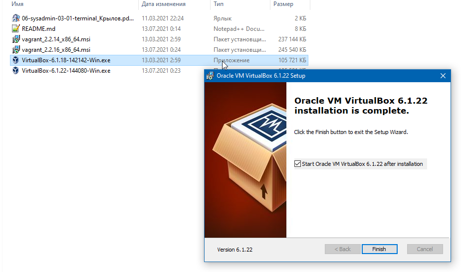
   
1. Выполнено   
   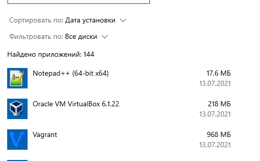
   
1. Выполнено 
   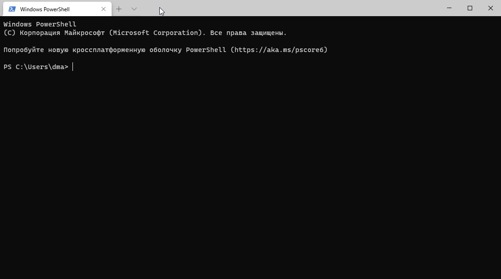
   
1. Выполнено 
   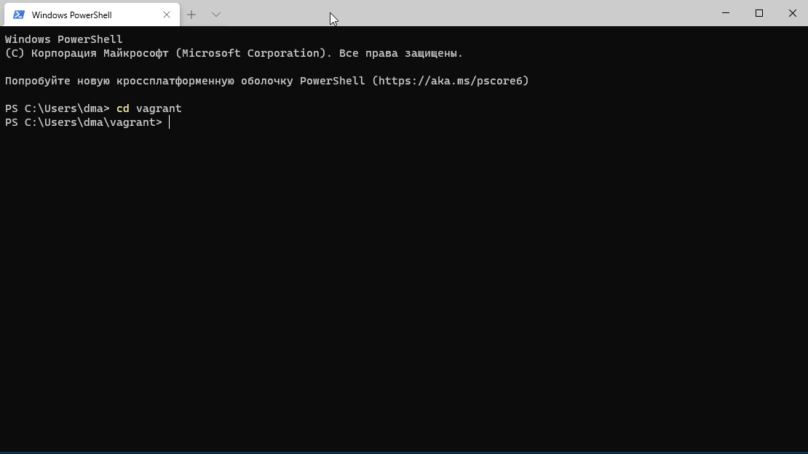
   
   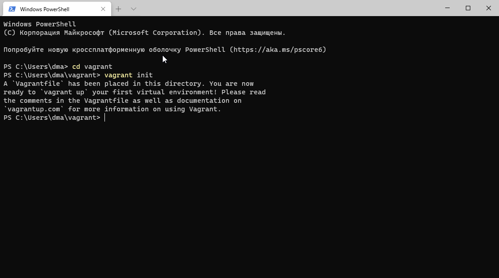
   
   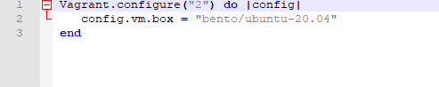

   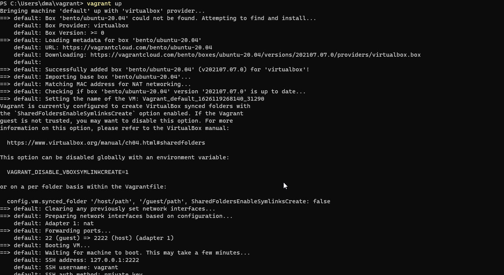

   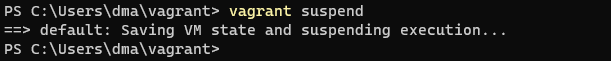

   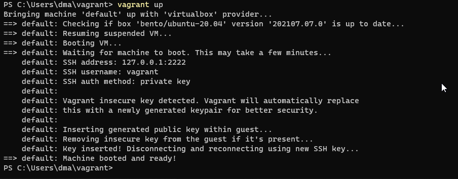

   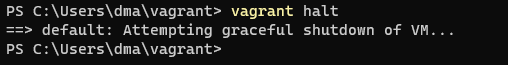

1. Выполнено 
   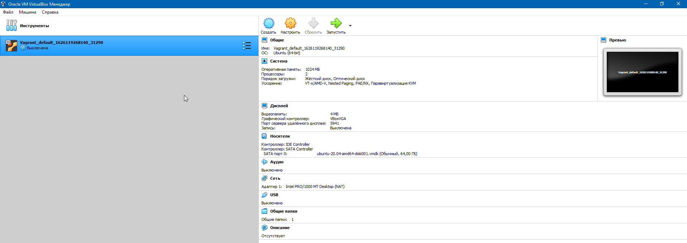
   По-умолчанию выделено:1024 Мб оперативной памяти, 2 процессора, жесткий диск, оптический диск, 4 Мб видеопамяти.

1. Ознакомился.
   Добавить оперативную память или ресурсы процессора можно либо через графический интерфейс **Oracle VM VirtualBox**, либо с помощью утилиты **VBoxManage**, например с помощью команд `VBoxManage modifyvm "Vagrant_default_1626119268140_31290" --memory 2048` и `VBoxManage modifyvm "Vagrant_default_1626119268140_31290" --cpus 4`.
   
1. Выполнено 
   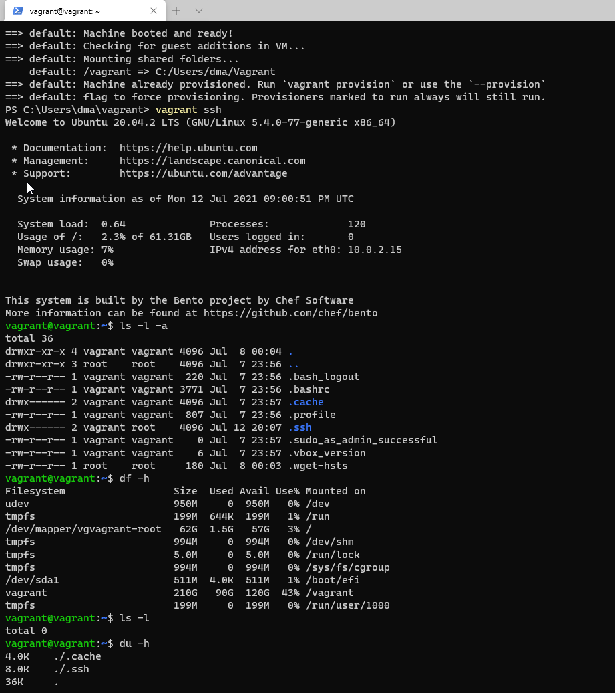

1. Ознакомиться с разделами `man bash`, почитать о настройках самого bash:
    * какой переменной можно задать длину журнала `history`, и на какой строчке manual это описывается?
    * что делает директива `ignoreboth` в bash?
1. В каких сценариях использования применимы скобки `{}` и на какой строчке `man bash` это описано?
1. Основываясь на предыдущем вопросе, как создать однократным вызовом `touch` 100000 файлов? А получилось ли создать 300000?
1. В man bash поищите по `/\[\[`. Что делает конструкция `[[ -d /tmp ]]`
1. Основываясь на знаниях о просмотре текущих (например, PATH) и установке новых переменных; командах, которые мы рассматривали, добейтесь в выводе type -a bash в виртуальной машине наличия первым пунктом в списке:

	```bash
	bash is /tmp/new_path_directory/bash
	bash is /usr/local/bin/bash
	bash is /bin/bash
	```

	(прочие строки могут отличаться содержимым и порядком)

1. Чем отличается планирование команд с помощью `batch` и `at`?

1. Завершите работу виртуальной машины чтобы не расходовать ресурсы компьютера и/или батарею ноутбука.

 
 ---

### Как оформить ДЗ?

Домашнее задание выполните в файле readme.md в github репозитории. В личном кабинете отправьте на проверку ссылку на .md-файл в вашем репозитории.

Также вы можете выполнить задание в [Google Docs](https://docs.google.com/document/u/0/?tgif=d) и отправить в личном кабинете на проверку ссылку на ваш документ.
Название файла Google Docs должно содержать номер лекции и фамилию студента. Пример названия: "1.1. Введение в DevOps — Сусанна Алиева"
Перед тем как выслать ссылку, убедитесь, что ее содержимое не является приватным (открыто на комментирование всем, у кого есть ссылка). 
Если необходимо прикрепить дополнительные ссылки, просто добавьте их в свой Google Docs.

Любые вопросы по решению задач задавайте в чате Slack.

---
