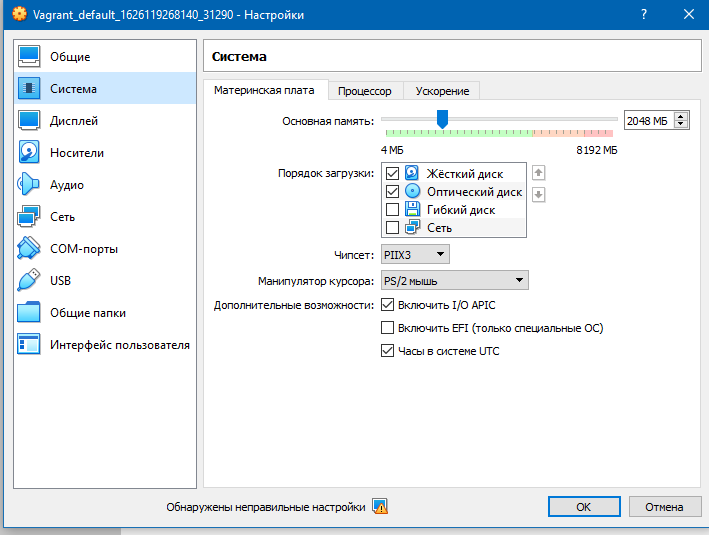
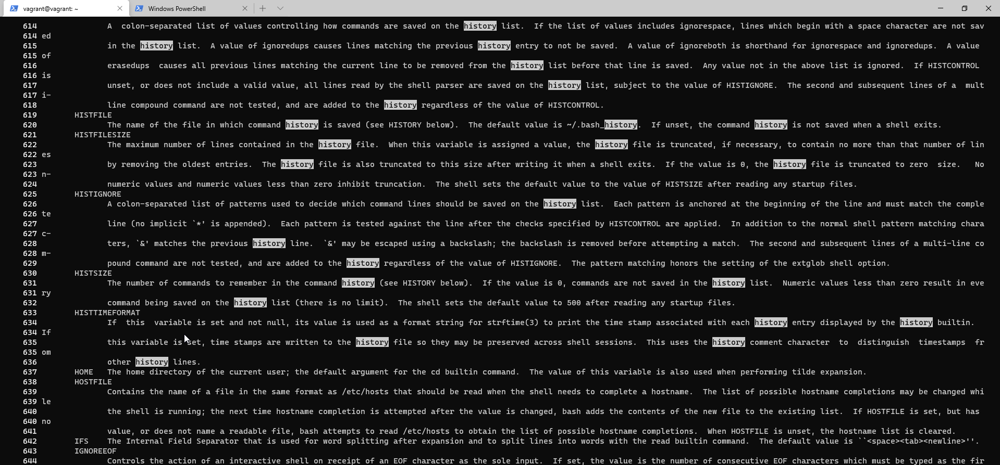
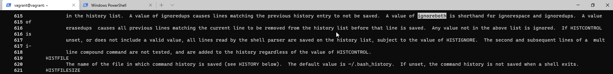
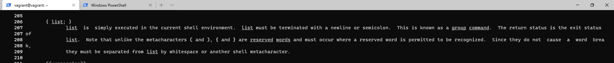
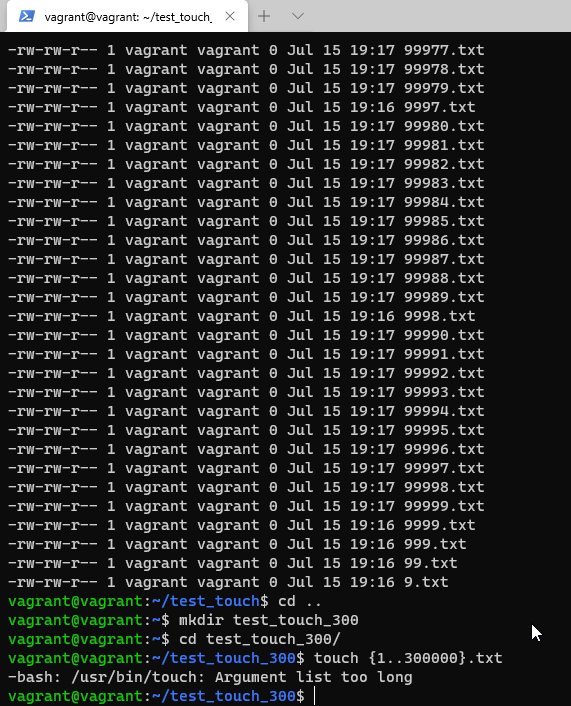
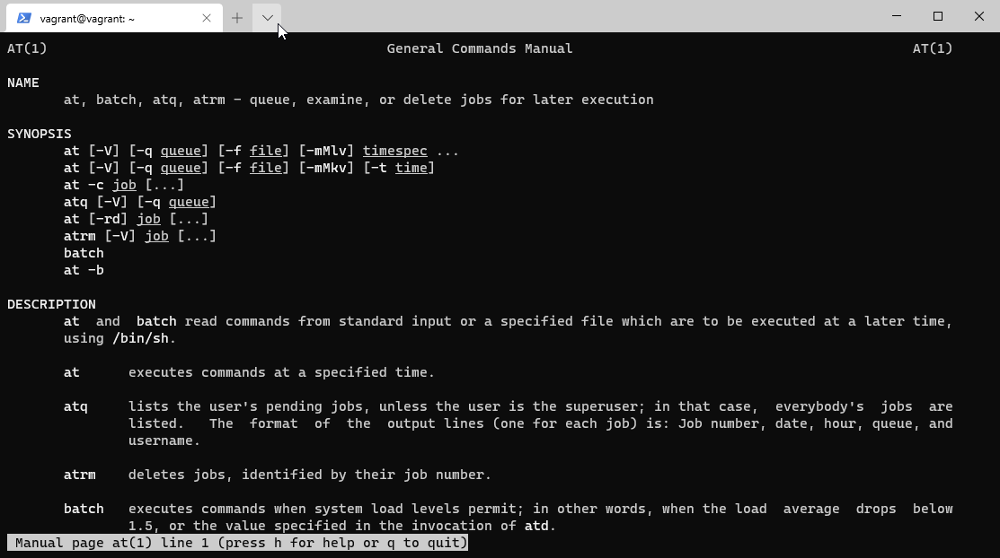
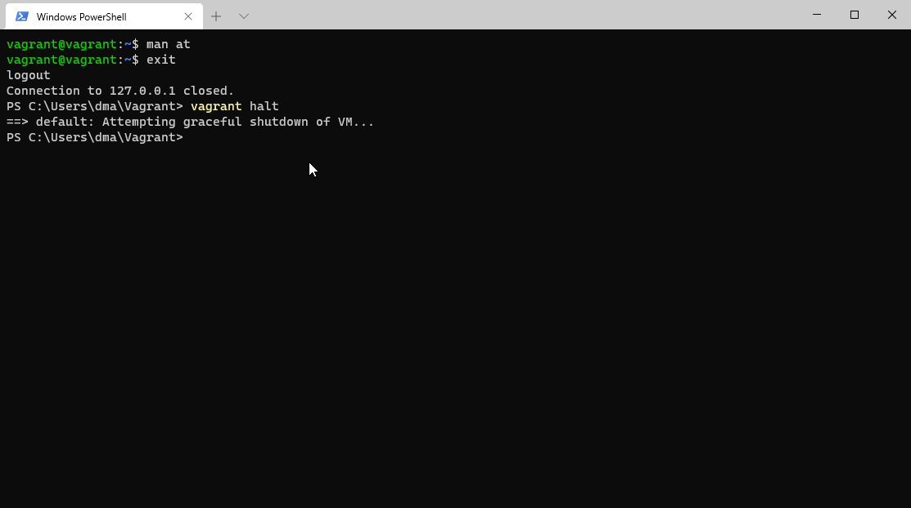

# Домашнее задание к занятию "3.1. Работа в терминале, лекция 1"

1. Выполнено.
   
   
1. Выполнено.
   
   
1. Выполнено.
   
   
1. Выполнено.
   
   
   
   
   

   

   

   

   

1. Выполнено.
   
   По-умолчанию выделено:1024 Мб оперативной памяти, 2 процессора, жесткий диск, оптический диск, 4 Мб видеопамяти.

1. Ознакомился.
   Добавить оперативную память или ресурсы процессора можно либо через графический интерфейс **Oracle VM VirtualBox**
   , 
   либо с помощью утилиты **VBoxManage**, например с помощью команд `VBoxManage modifyvm "Vagrant_default_1626119268140_31290" --memory 2048` и `VBoxManage modifyvm "Vagrant_default_1626119268140_31290" --cpus 4`.
   
1. Выполнено.
   

1. Выполнено.
   * Переменная **HISTFILESIZE**, описано на 621 строке man bash.
     
   * Значение ignoreboth является сокращением для ignorespace и ignoredups.
     

1. Выполнено.
   
   В составных командах. Строка 206
    
1. Выполнено.
   
   Командой `touch {1..100000}.txt`. 
   
   300000 создать не получилось, слишком большой список аргументов.
    

1. Выполнено.
   
   Конструкция проверяет существует ли директория /tmp.
1. Выполнено.
   
   Последовательно выполнить команды:
   
   `mkdir /tmp/new_path_directory`
   
   `cp /bin/bash /tmp/new_path_directory`
   
   `sudo mkdir /usr/local/bin`
   
   `sudo cp /bin/bash /usr/local/bin`
   
   `PATH=/tmp/new_path_directory:/usr/local/bin:/bin:$PATH`
  
   

1. Команда `at` планирует выполнение команды в указанное время, а команда `batch` планирует выполнение команды, когда это позволяет уровень загрузки системы.

   
   
1. Выполнено.
   
   