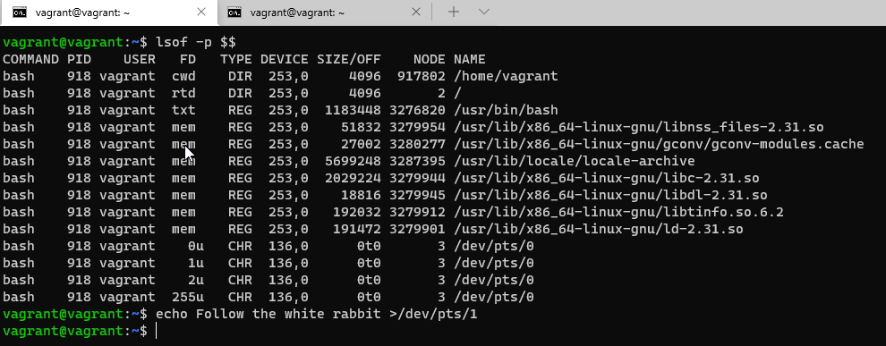

# Домашнее задание к занятию "3.2. Работа в терминале, лекция 2"

1. Это builtin (встроенная) команда Bash, она изменяет текущий каталог. Встроенная для того чтобы менять текущую папку только для оболочки, в которой выполняется.  
   
   
1. `grep 12345 /tmp/some_file.txt -c`
   
   
1. systemd  
   
   
1. `ls -l \root 2>/dev/pts/1`  
     
   
   

1. 