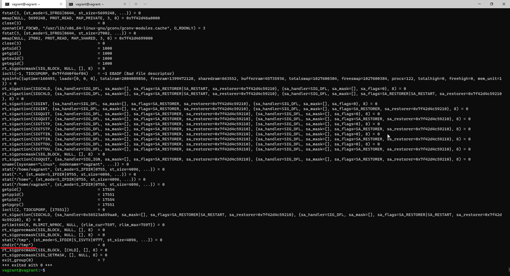
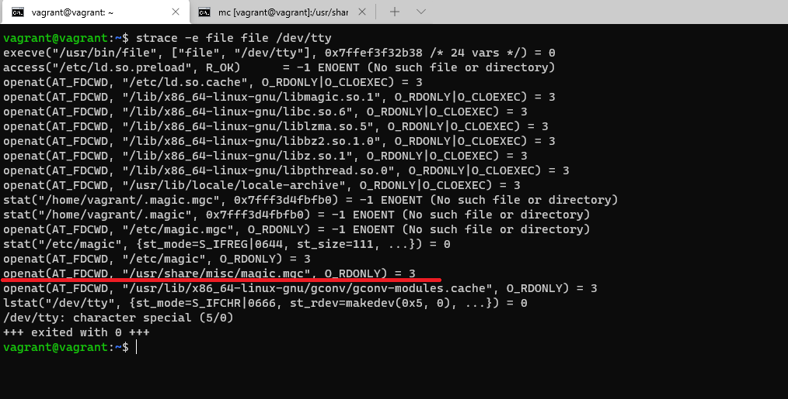
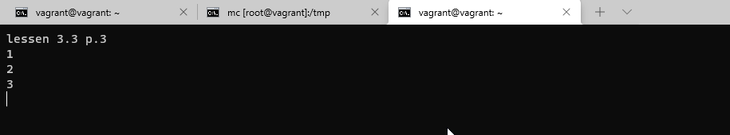
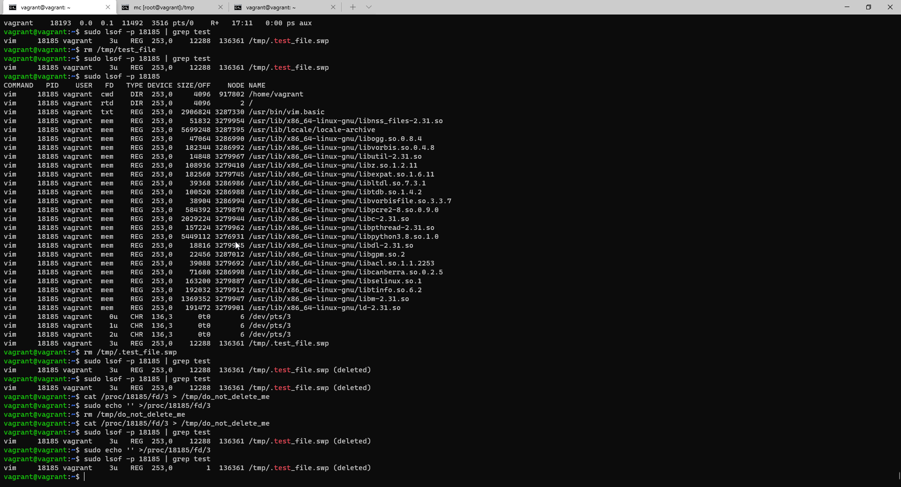
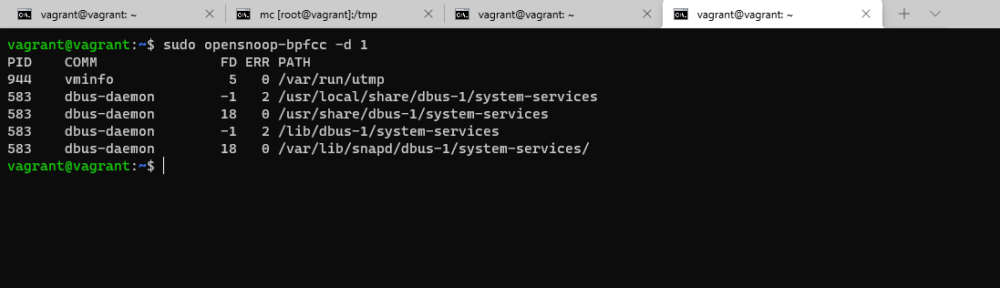
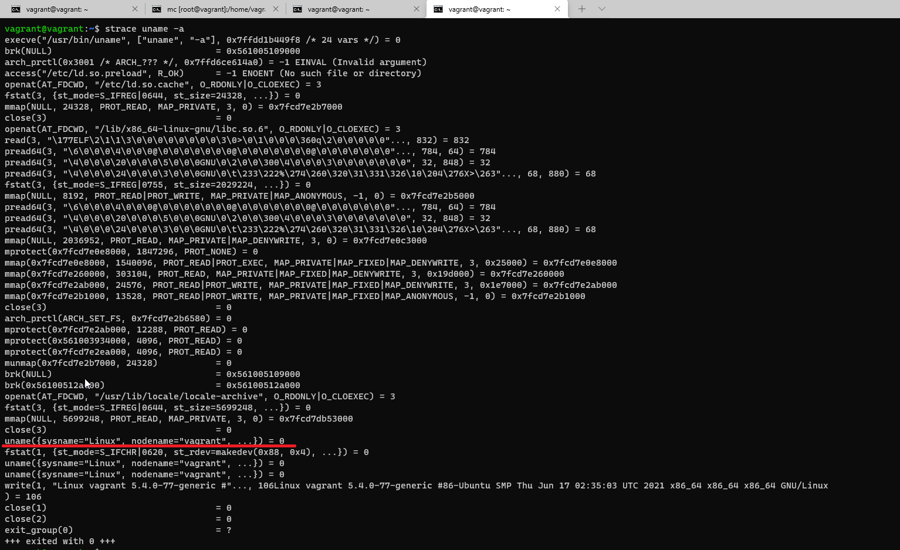
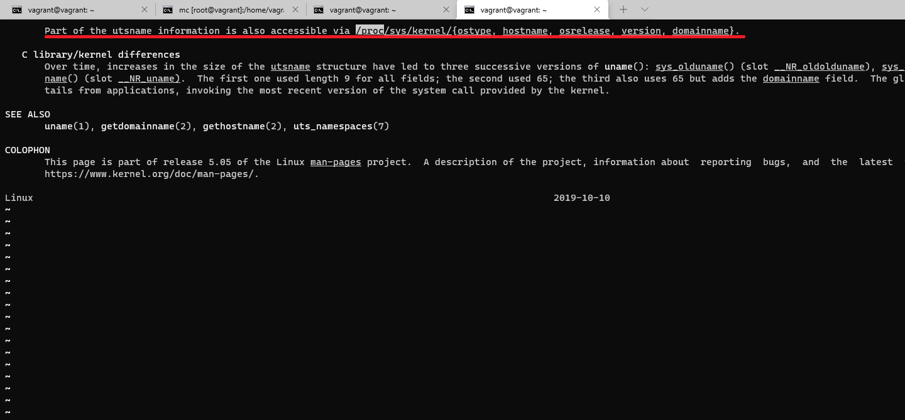
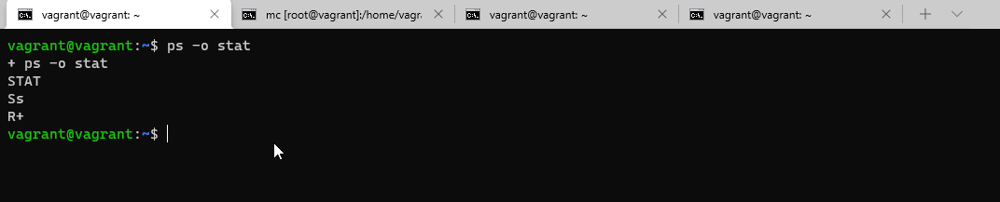
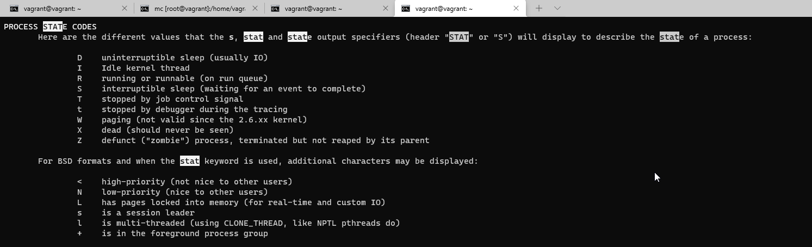

# Домашнее задание к занятию "3.3. Операционные системы, лекция 1"

1. Системный вызов `chdir("/tmp")`.      
     
   
1. База находится в файле`/usr/share/misc/magic.mgc`.  
     
   
1. Без sudo не получалось, пришлось все делать под sudo.  
* В соседнем окне терминала в vim создал текстовый файл `/tmp/test_file`, сохранил его  
     
   - С помощью команды `ps aux | grep 'vim'` узнал PID процесса vim (18185)  
   - С помощью команды `sudo lsof -p 18185 | grep test` узнал что он использует файл `/tmp/.test_file.swp`  
   - С помощью команды `rm /tmp/.test_file.swp` удалил этот файл  
   - С помощью команды `sudo lsof -p 18185 | grep test` убедился что он удалён, но занимает место (12288 Kb)  
   - С помощью команды `sudo echo '' >/proc/18185/fd/3` очистил файл   
   - С помощью команды `sudo lsof -p 18185 | grep test` убедился что размер файла уменьшился. (1 Kb)
     
  
   *Пробовал также вывести запись лога с помощью команды `ping 127.0.0.23 > log &`. Но команда `sudo lsof -p 17860 | grep log` показывает что у него дескриптор `1`, и не получается его очистить командой `sudo echo '' >/proc/17860/fd/1`, пишет `Permission denied`.*  
   
1. Зомби-процесс при завершении освобождает все свои ресурсы, кроме идентификатора в таблице процессов.   
      
1. Опять же без sudo не получалось.  
   Результат команды `sudo opensnoop-bpfcc -d 1` на скрине:  
     
   
1. Системный вызов `uname`  
     
   
   Цитата  из `man 2 uname`:  
   `Part of the utsname information is also accessible via /proc/sys/kernel/{ostype, hostname, osrelease, version, domainname}.`  
     
   
1. Оператор `;` это разделитель последовательных команд, а `&&` это управляющий оператор.  
   `set -e` - завершит сессию если конвейер исполняемых команд возвращает ненулевое значение, кроме самой последней команды.  
   Использовать `&&` вместе с `set -e` бессмысленно, т.к. при ошибке, выполнение команд прекратиться.  
   
1. `-e` Прерывает выполнение исполнения при ошибке любой команды кроме последней в последовательности;  
   `-x` Режим отладки. Перед выполнением команды печатает её со всеми уже развернутыми подстановками и вычислениями;  
   `-u` Рассматривает сброс (unset) переменной как ошибку при выполнении parameter expansion. Неинтерактивные оболочки завершают свое выполнение при такой ошибке.  
   `-o` Устаналивает или снимает опцию по её длинному имени. Например set -o noglob. Если никакой опции не задано, то выводится список всех опций и их статус.  
   `pipefail` Возвращает код возврата набора/последовательности команд, ненулевой при последней команды или 0 для успешного выполнения команд.  
  
   `set -euxo pipefail` хорошо использовать для более детализированного вывода ошибок, и прерывания выполнения сценария в случае возникновения ошибок (кроме последней  команды).  
   
1. Наиболее часто встречающиеся статусы:
  `Ss` - обычный спящий процесс, который может быть прерван, ожидает какого-то события, является лидером сессии.  
  `R+` - исполняется или ожидает исполнения, находится в группе процессов переднего плана.  
     
   
   Дополнительные символы это дополнительные характеристики состояния процесса, например приоритет.  
     