# Домашнее задание к занятию "3.4. Операционные системы, лекция 2"  
  
1. Скачал node_exporter и разархивировал, скопировал исполняемый файл в директорию /usr/local/bin.  
   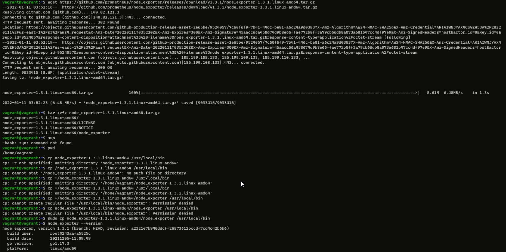  
   
   Создал внешний файл конфигурации `/etc/default/node_exporter`.  
     
   
   Создал файл службы systemd.  
   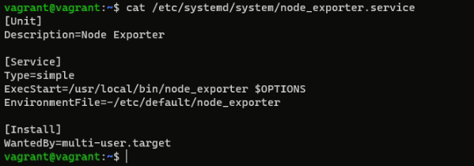  
   
   Добавил службу в автозагрузку командой `sudo systemctl enable node_exporter.service`, перезагрузил виртуалку vagrant, проверил автозагрузку, остановку, запуск сервиса.  
   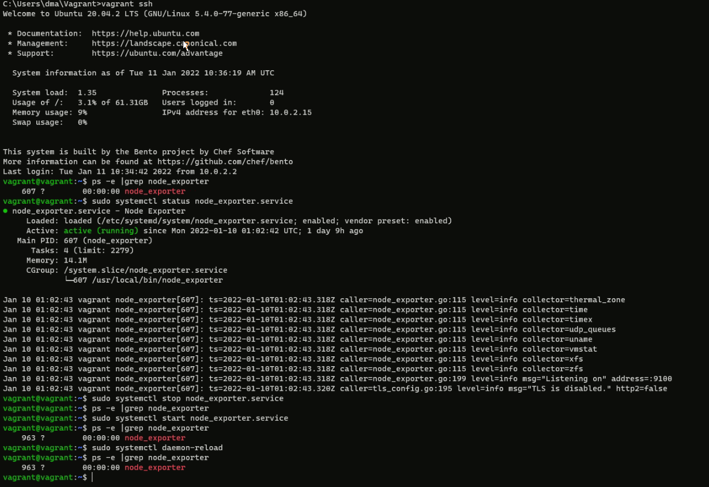  
   
   Systemd будет подгружать переменные окружения при старте node_exporter из файла `/etc/default/node_exporter`, а параметры запуска искать в переменной OPTIONS.  
   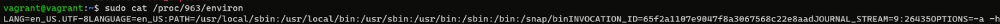  
   
1. Пробросил порт 9100 на хостовую машину.  
   Ознакомился с опциями node_exporter и выводом /metrics по-умолчанию.  
   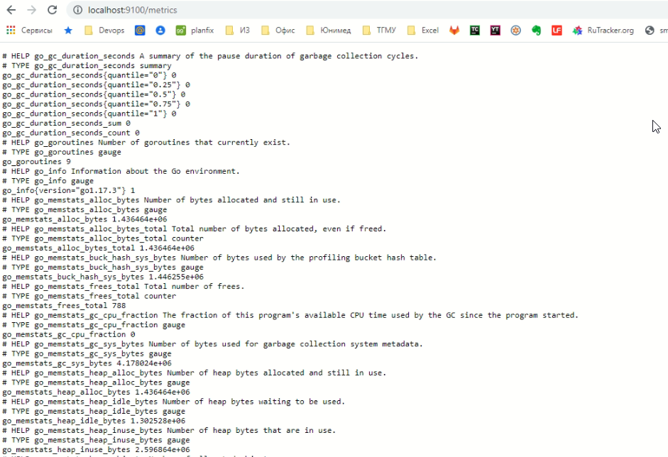  
   Для базового мониторинга выбрал бы опции:  
   - CPU:  
    node_cpu_seconds_total  
	node_pressure_cpu_waiting_seconds_total  
    process_cpu_seconds_total  
    
   - Memory:  
    node_memory_MemAvailable_bytes  
    node_memory_MemFree_bytes  
	node_memory_MemTotal_bytes  
	node_memory_Buffers_bytes  
	node_memory_Cached_bytes  
	node_memory_SwapCached_bytes  
	node_memory_SwapFree_bytes  
	node_memory_SwapTotal_bytes  
    
   - Disk:  
    node_disk_io_time_seconds_total  
	node_disk_read_bytes_total  
    node_disk_read_time_seconds_total  
	node_disk_writing_bytes_total  
    node_disk_write_time_seconds_total  
    
   - Network:  
    node_network_receive_bytes_total  
	node_network_receive_errs_total  
    node_network_transmit_bytes_total  
    node_network_transmit_errs_total  
	node_network_transmit_packets_total  
   
1. Установил Netdata, внес изменения в конфигурационный файл  `/etc/netdata/netdata.conf`  
   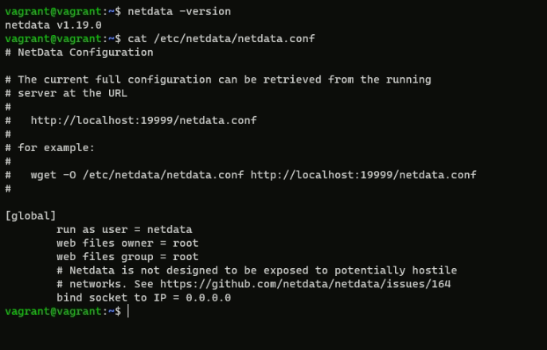  
   
   Добавил в Vagrantfile проброс порта Netdata на свой локальный компьютер  
   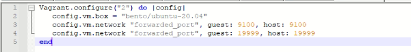  
   
   Ознакомился с метриками Netdata  
   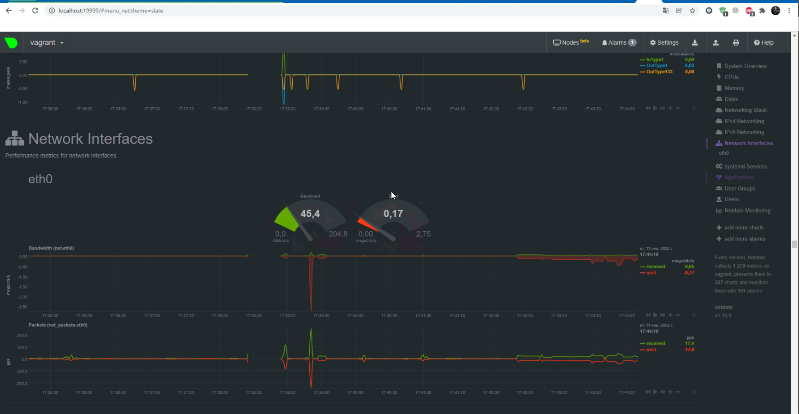  
   
1. Да, можно. На это указывают параметры `Booting paravirtualized kernel on KVM` и `systemd[1]: Detected virtualization oracle`.  
   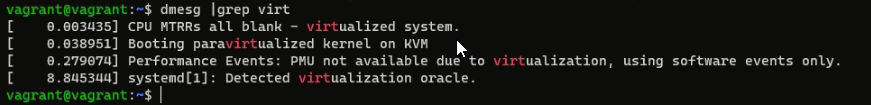  
   
1. По-умолчанию `1048576`.  
     
   
   Это параметр максимального числа открытых дескрипторов.  
   Другой существующий лимит, который  не позволит достичь такого числа `ulimit -Hn`.  
   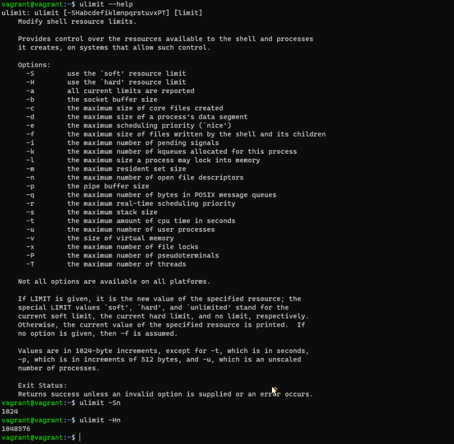  
   
1. Выполнено.  
   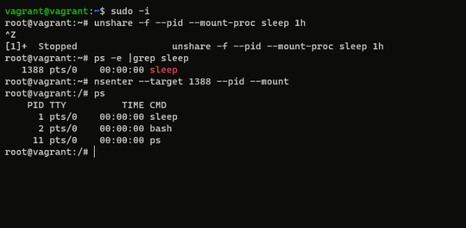  
   
1. Это fork-бомба, которая порождает большое количество собственных копий и тем самым пытается заполнить свободное место в списке активных процессов операционной системы.  
   Запустил.  
   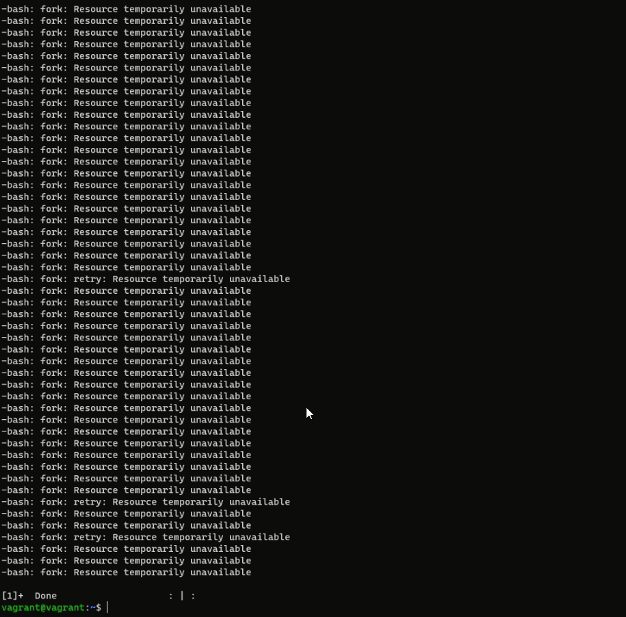  
   
   Судя по выводу `dmesg` стабилизации помог механизм `cgroups` – это механизм ядра, позволяющий ограничивать использование, вести учет и изолировать потребление системных ресурсов.  
   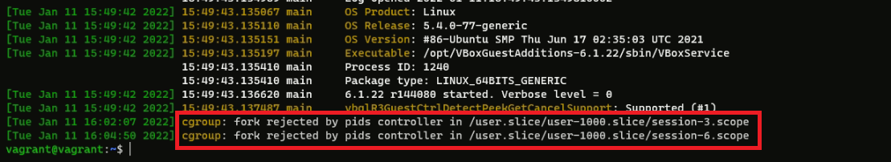.  
   
   Число процессов, которое можно создать в сессии задается в файле `pids.max` для каждой подсистемы группы.  
   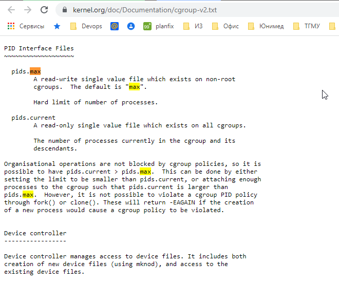.  