# Домашнее задание к занятию "3.7. Компьютерные сети (лекция 2)"  
  
1. В linux  `ifconfig` и `ip -c -br l`.  
   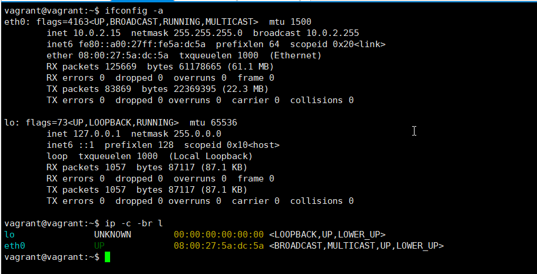  
   
   В windows `ipconfig`.  
   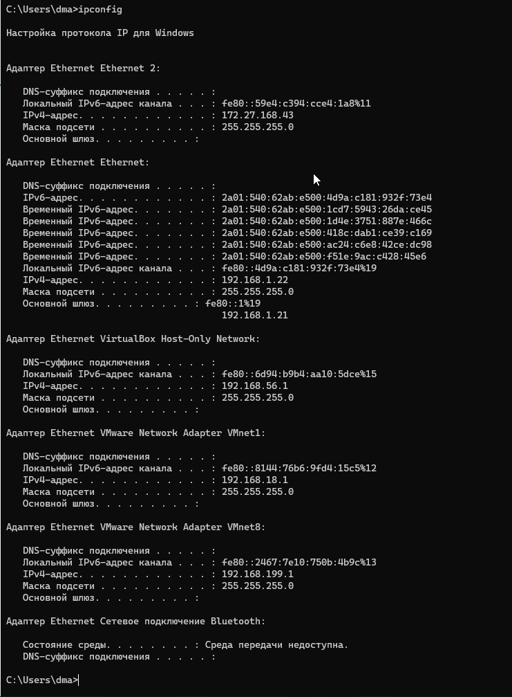  
   
1. LLDP – протокол для обмена информацией между соседними устройствами, позволяет определить к какому порту коммутатора подключен сервер. Командой `lldpctl` можно посмотреть соседей.  
   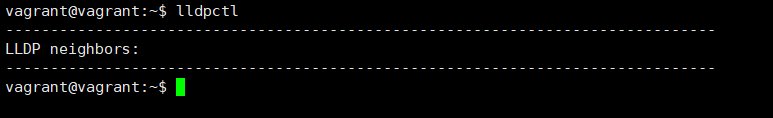  

1. Технология `VLAN`.  
   В linux устанавливается пакет `vlan`.  
   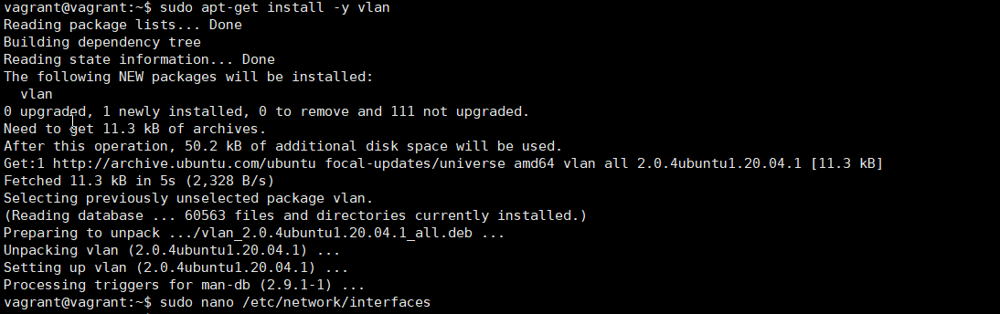  
   
   Пример конфига:  
   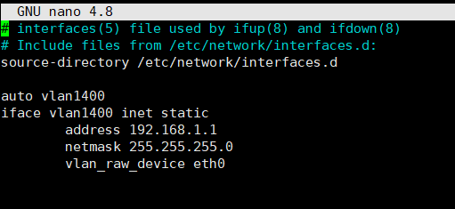  

1. Типы агрегации интерфейсов: `bond` и `team`.  
   Опции для балансировки нагрузки:  

   `mode=0 (balance-rr)`. Последовательно кидает пакеты, с первого по последний интерфейс.  
   `mode=1 (active-backup)`. Один из интерфейсов активен. Если активный интерфейс выходит из строя (link down и т.д.), другой интерфейс заменяет активный. Не требует дополнительной настройки коммутатора.  
   `mode=2 (balance-xor)`. Передачи распределяются между интерфейсами на основе формулы ((MAC-адрес источника) XOR (MAC-адрес получателя)) % число интерфейсов. Один и тот же интерфейс работает с определённым получателем. Режим даёт балансировку нагрузки и отказоустойчивость.  
   `mode=3 (broadcast)`. Все пакеты на все интерфейсы.  
   `mode=4 (802.3ad)`. Link Agregation — IEEE 802.3ad, требует от коммутатора настройки.  
   `mode=5 (balance-tlb)`. Входящие пакеты принимаются только активным сетевым интерфейсом, исходящий распределяется в зависимости от текущей загрузки каждого интерфейса. Не требует настройки коммутатора.  
   `mode=6 (balance-alb)`. Тоже самое что 5, только входящий трафик тоже распределяется между интерфейсами. Не требует настройки коммутатора, но интерфейсы должны уметь изменять MAC.  
   Пример конфига:  
   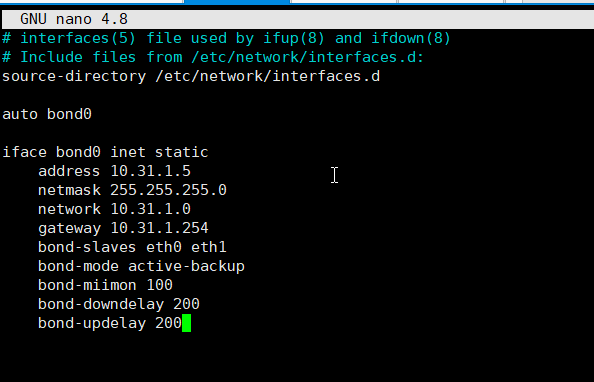  
   
1. В сети с маской /29 - 8 ip адресов.  
   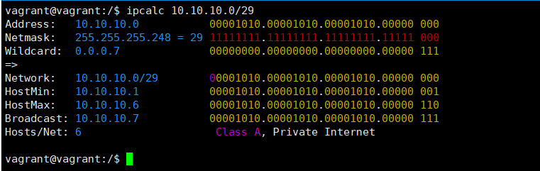  
   
   В сети с маской /24 256 ip адресов.  
   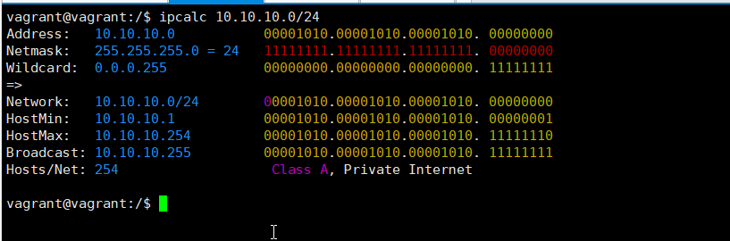  
   
   для сети с маской /29 требуется 8 ip адресов, 256/8=32 сети можо получить.  
   Примеры /29 подсетей:  
   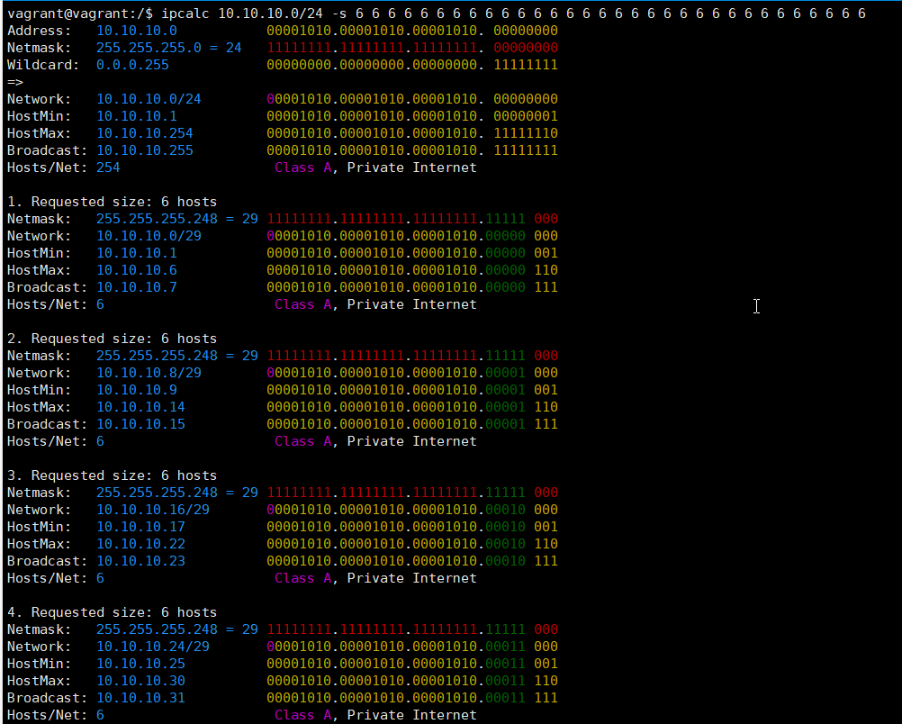  
   
1. Допустимо взять адреса из подсети 100.64.0.0/26.  
   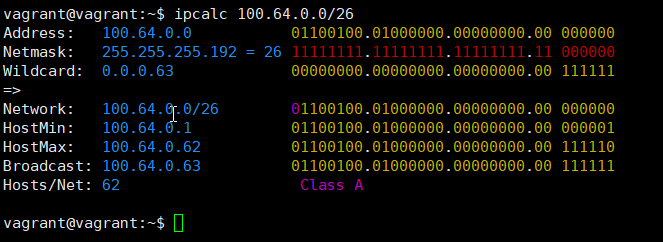  
   
1. В linux:  
   `arp` просмотреть.  
   `ip neigh flush all` очистить ARP кеш полностью.  
   `arp -d 192.168.1.1` удалить только один IP.  
   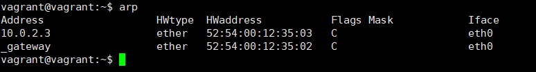  
   
   В windows:  
   `arp -a` просмотреть.  
   `arp -d *` очистить ARP кеш полностью.  
   `arp -d 192.168.1.1` удалить только один IP.  
   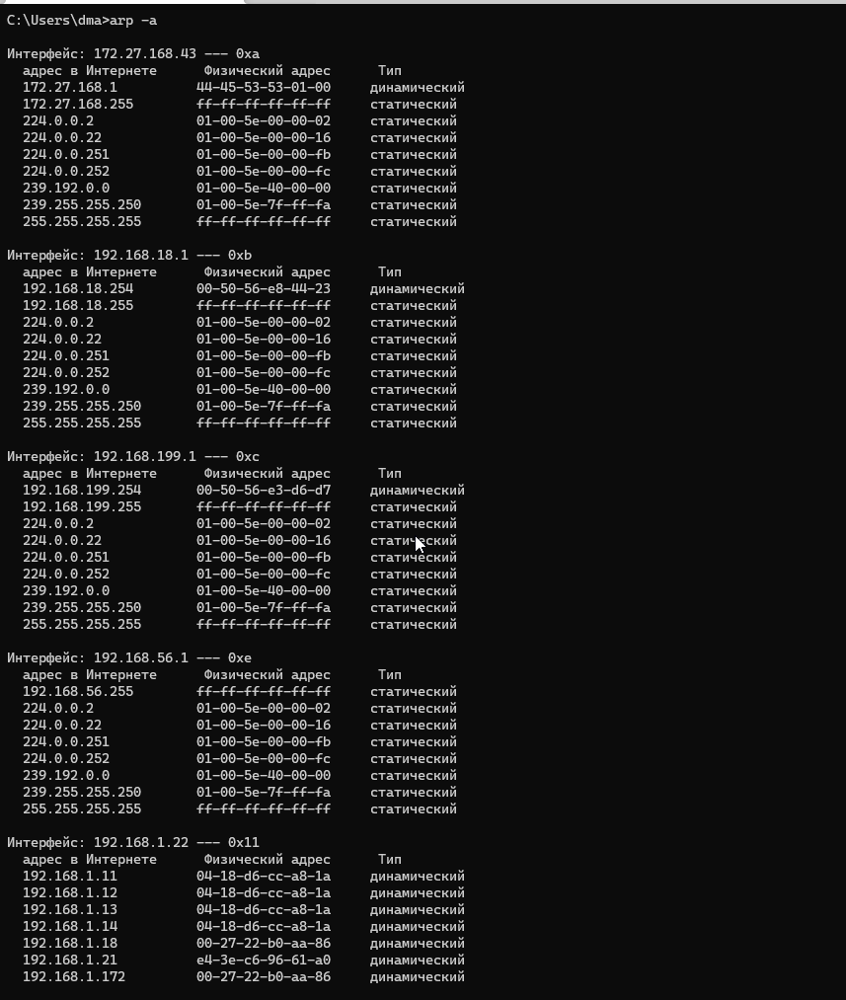  