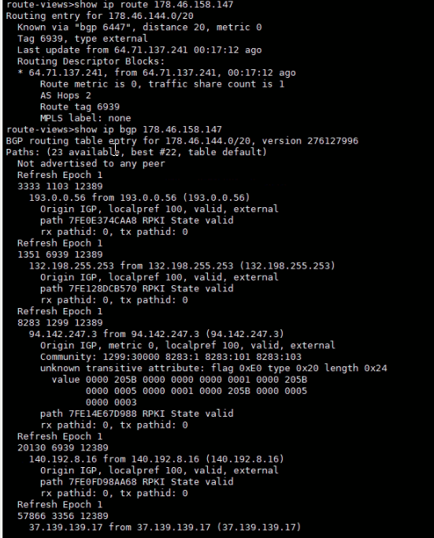
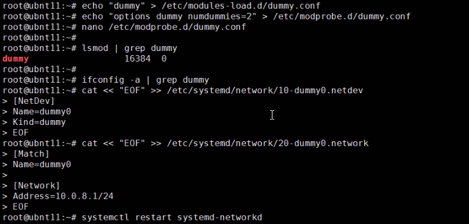
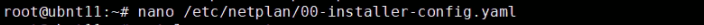
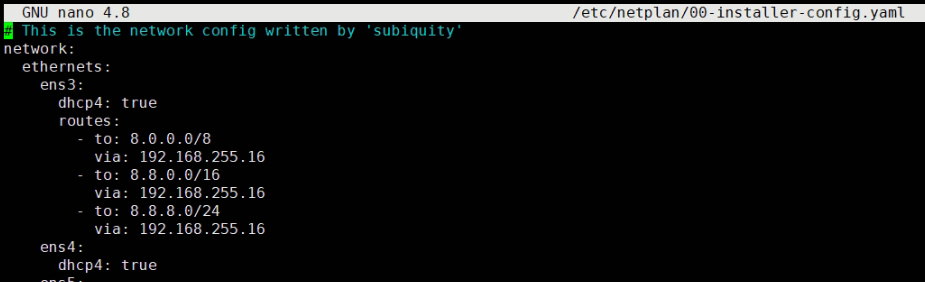
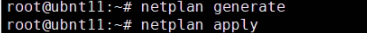
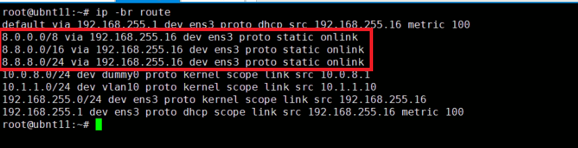
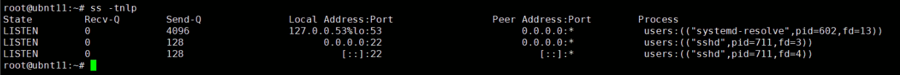
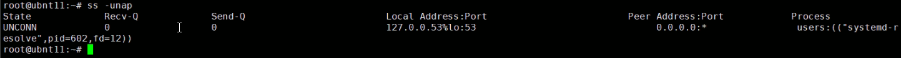
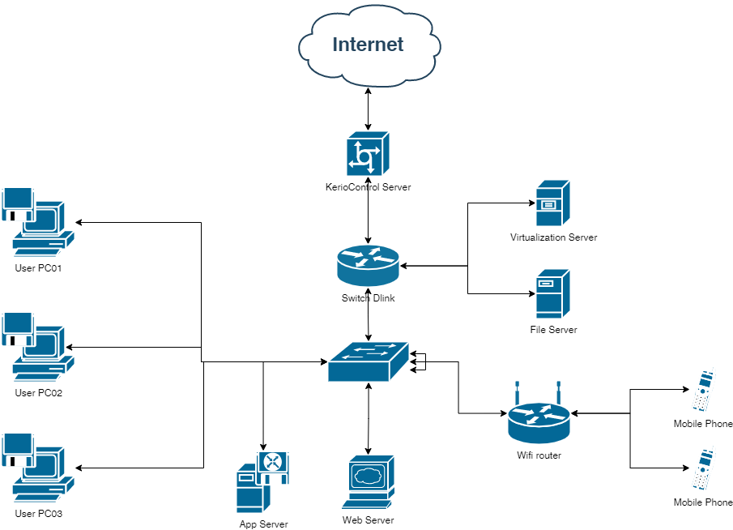

# Домашнее задание к занятию "3.8. Компьютерные сети (лекция 3)"  
  
1. Выполнено.  
     
   
1. Создал dummy0 интерфейс.  
     
   
   Добавил несколько маршрутов.  
     
     
     
     
     

1. Выполнено.  Порты 53 (DNS) и 22 (SSH).  
     

1. Выполнено.  Порт 53 (DNS).  
     
   
1. Выполнено.  
     