# Домашнее задание к занятию "3.9. Элементы безопасности информационных систем"  
  
1. Выполнено.  
   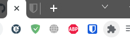  
   
   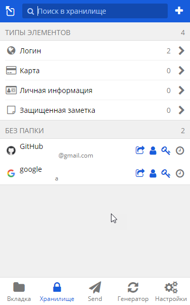  
   
1. Выполнено.  
   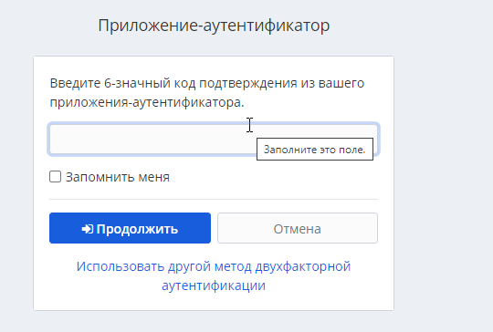  
   
   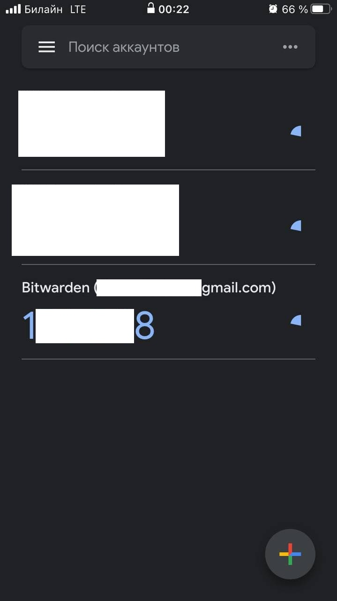  

1. Установил apache2.  
   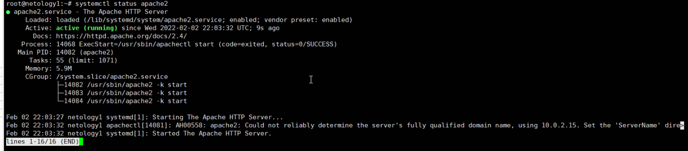  
   
   Сгенерировал сертификат.  
   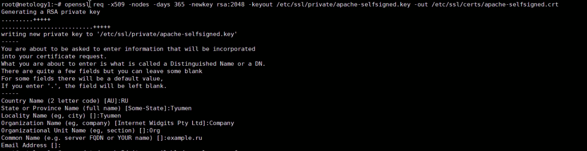  
   
   Создал файл конфигурации тестового сайта.  
   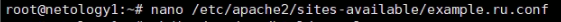  
   
   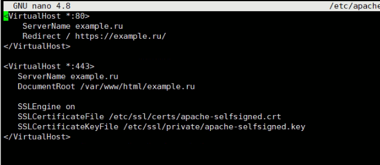  
   
   Создал директорию  тестового сайта.  
   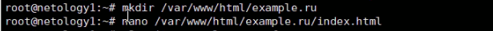  
   
   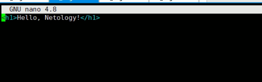  
   
   Перезапустил тестовый сайт.  
   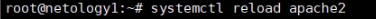  
   
   Протестировал сайт.  
   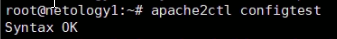  
   
   Открыл сайт на хосте, проверил сертификат.  

1. Проверил на уязвимости сайт medinfocenter.ru  
   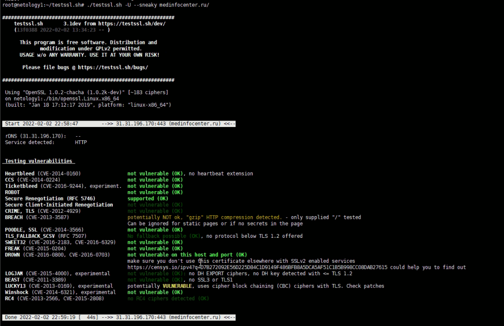  