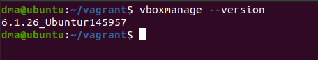
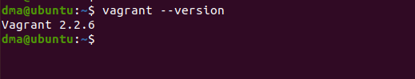
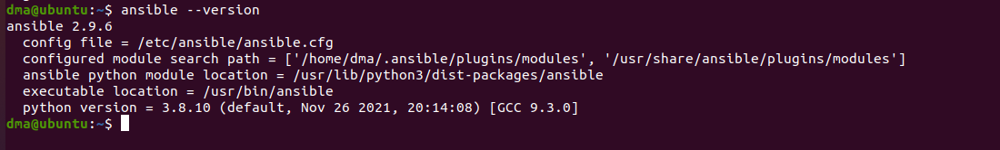
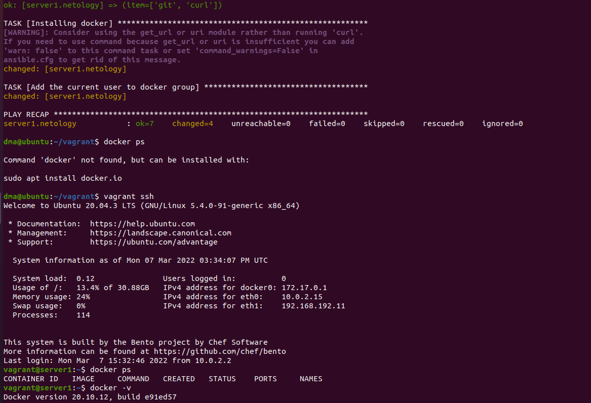

# Домашнее задание к занятию "5.2 Применение принципов IaaC в работе с виртуальными машинами"  

1. 
Возможность быстро разворачивать продуктовые и тестовые среды. Минимизация ошибок при развертывании, за счет исключения человеческого фактора. Версионность. Скорость и удобство масштабирования.  
Всегда одинаковый результат за счет основополагающего принципа- идемпотентности.  

2.
Простота настройки и использования, не требует установки и настройки агентов на клиентских ВМ, работает по ssh, большое количество разнообразных модулей.  
На мой взгляд более надежный метод push, т.к. мы сами отправляем конфигурации, и в случае недоставки получим сообщение об ошибке.  
Хотя в отдельных случаях возможно более надежным окажется метод pull или гибридный. Все зависит от инфрастуктуры и поставленной задачи.  
3.  
- VirtualBox  
```
dma@ubuntu:~/vagrant$ vboxmanage --version
6.1.26_Ubuntur145957
```
  
- Vagrant  
```
dma@ubuntu:~$ vagrant --version
Vagrant 2.2.6
```
  
- Ansible  
```
dma@ubuntu:~$ ansible --version
ansible 2.9.6
  config file = /etc/ansible/ansible.cfg
  configured module search path = ['/home/dma/.ansible/plugins/modules', '/usr/share/ansible/plugins/modules']
  ansible python module location = /usr/lib/python3/dist-packages/ansible
  executable location = /usr/bin/ansible
  python version = 3.8.10 (default, Nov 26 2021, 20:14:08) [GCC 9.3.0]
```
  

4.
```
vagrant@server1:~$ docker ps
CONTAINER ID   IMAGE     COMMAND   CREATED   STATUS    PORTS     NAMES
vagrant@server1:~$ docker -v
Docker version 20.10.12, build e91ed57
```
  