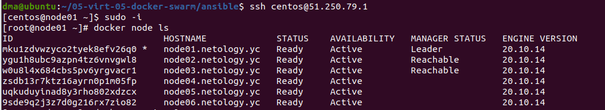
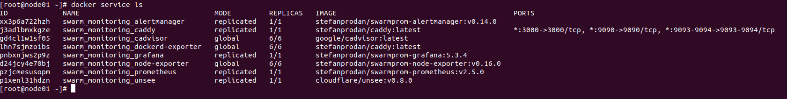
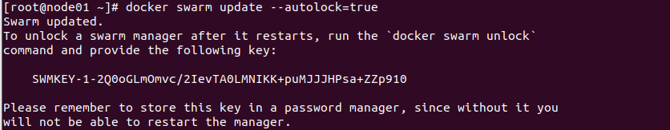

# Домашнее задание к занятию "5.5. Оркестрация кластером Docker контейнеров на примере Docker Swarm"

1.  

- В режиме **replication**, сервис будет запущен на выбранной автоматически нодже или ноде удовлетворяющей deploy constraints.  
В режиме **global**, сервис будет запущен на каждой ноде кластера swarm.  

- Для выбора нового лидера используется алгоритм распределённого консенсуса Raft.  
Нода может быть в одном из трех состояний - Follower, Candidate и Leader. Изначально все узлы являются Followers и если они не слышат лидера, они могут стать кандидатами по таймауту (election timeout), который выбирается случайным образом между 150ms и 300ms. Как только кто-то из Followers становится Кандидатом, он запускает новый срок выбора (election term). Сначала голосует сам за себя, затем запрашивает голоса у других нод, и если те еще не голосовали в этом election term, они отдают свой голос за него, сбрасывая свой election timeout. Как только кандидат наберет большинство голосов, то он и становится лидером. Далее лидер начинает посылать сообщения о том, что он лидер, другим нодам, в интервале Heartbeat. А если Follovers перестают получать их, то процесс выбора кандидата начинается заново.  

- Overlay Network это логическая сеть создаваемая поверх другой сети. В случае docker - это сеть создаваемая поверх сети хоста, объединяющая контейнеры в локальную сеть.  

2.  

Создал.  
  

3.  

Создал.  
  

4. (*)  

Выполнил.  
  

Данная команда позволяет защитить от злоумышленников общий ключ шифрования swarm, используемый для шифрования связи между узлами, и ключ, используемый для шифрования и дешифрования журналов Raft на диске, позволяя нам стать владельцем этих ключей и требуя ручной разблокировки при перезапуске сервиса docker. При перезагрузке docker не запустится, пока мы не разблокируем его командой docker swarm unlock, и не введем сгенерированный ключ.  
Можно менять этот ключ в любое время командой docker swarm unlock-key --rotate.