# Домашнее задание к занятию "6.2. SQL"

1.  
```docker pull postgres:12
docker volume create data
docker volume create backup
docker run --rm --name postgres -e POSTGRES_PASSWORD=postgres -ti -p 5432:5432 -v data:/var/lib/postgresql/data -v backup:/var/lib/postgresql/backup postgres:12```  
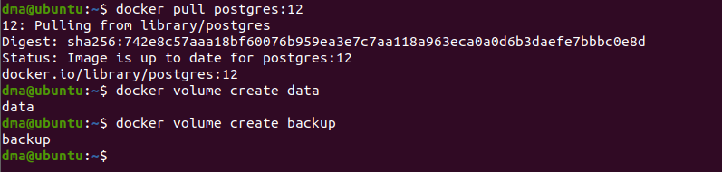  
  
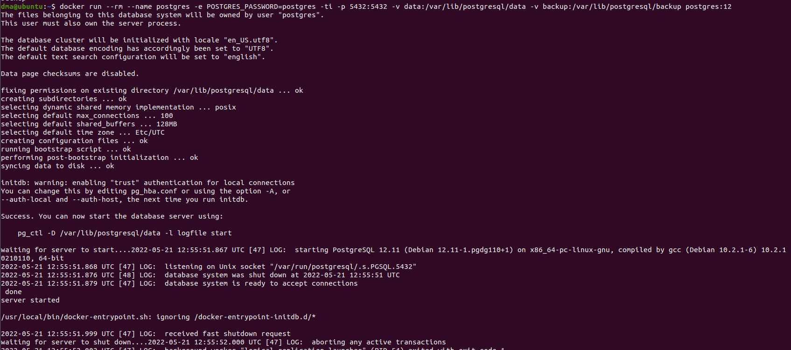  
  
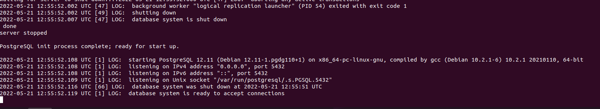  
  
2.  
  
В БД из задачи 1:  
- создайте пользователя test-admin-user и БД test_db  
```sudo docker ps
docker exec -it b51998272842 bash
psql -U postgres -p 5432
CREATE ROLE "test-admin-user" PASSWORD 'admin' SUPERUSER CREATEDB CREATEROLE INHERIT LOGIN;
CREATE DATABASE test_db;
exit```  
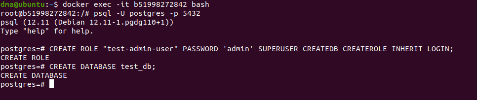  
  
- в БД test_db создайте таблицу orders и clients (спeцификация таблиц ниже)  
```psql -U postgres -d test_db
CREATE TABLE orders (
    id serial primary key,
    наименование varchar(80),
    цена int
);
CREATE TABLE clients (
    id serial primary key,
    фамилия varchar(20),
    страна_проживания varchar(20),
    заказ int REFERENCES orders (id)
);
CREATE INDEX ON clients (страна_проживания);```  
  
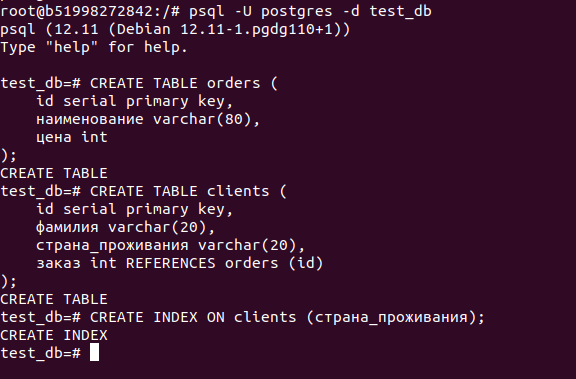  
  
- предоставьте привилегии на все операции пользователю test-admin-user на таблицы БД test_db  
`GRANT ALL ON TABLE public.clients, public.orders TO "test-admin-user";`  
- создайте пользователя test-simple-user  
`CREATE ROLE "test-simple-user" PASSWORD 'simple' NOSUPERUSER NOCREATEDB NOCREATEROLE INHERIT LOGIN;`  
- предоставьте пользователю test-simple-user права на SELECT/INSERT/UPDATE/DELETE данных таблиц БД test_db  
`GRANT INSERT, SELECT, UPDATE, DELETE ON TABLE public.clients, public.orders TO "test-simple-user";`  
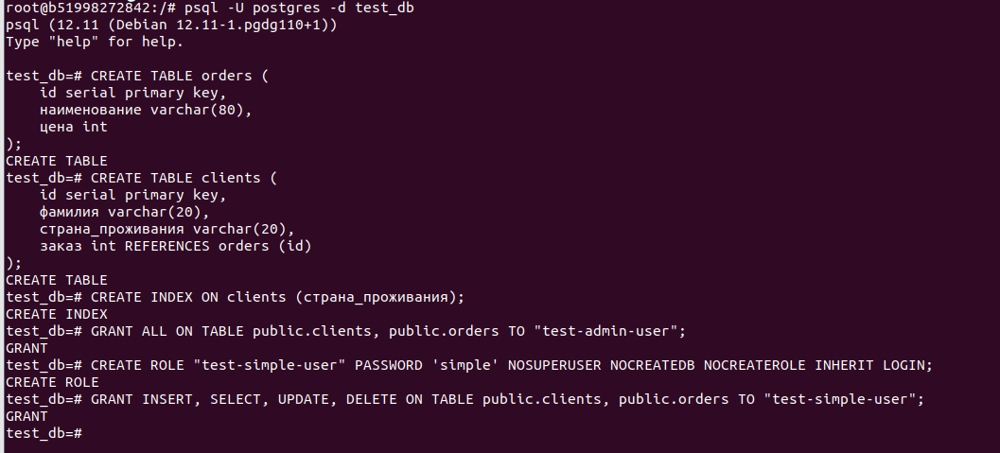  
  
Приведите:
- итоговый список БД после выполнения пунктов выше,  
`\l`  
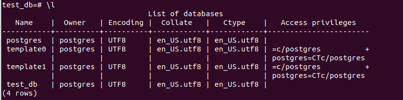  
  
- описание таблиц (describe)  
`\d clients`  
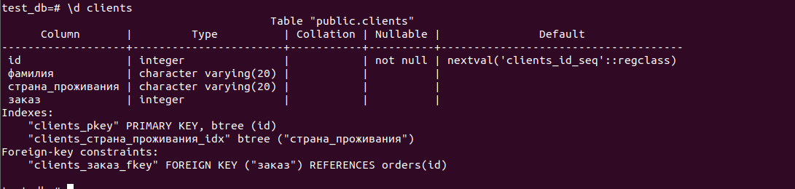  
`\d orders`  
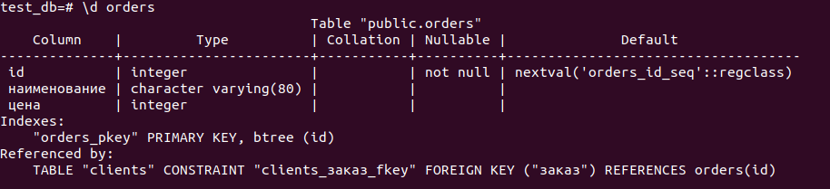  
  
- SQL-запрос для выдачи списка пользователей с правами над таблицами test_db  
- список пользователей с правами над таблицами test_db  
`SELECT * FROM information_schema.table_privileges WHERE table_catalog='test_db' and grantee IN ('test-admin-user', 'test-simple-user');`  
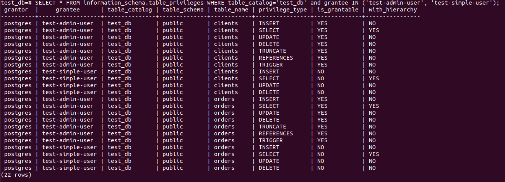  

3.  
*Дальше работал в dbeaver.*  
Используя SQL синтаксис - наполните таблицы следующими тестовыми данными:  
  
```INSERT INTO orders (наименование, цена) VALUES ('Шоколад', 10);
INSERT INTO orders (наименование, цена) VALUES ('Принтер', 3000);
INSERT INTO orders (наименование, цена) VALUES ('Книга', 500);
INSERT INTO orders (наименование, цена) VALUES ('Монитор', 7000);
INSERT INTO orders (наименование, цена) VALUES ('Гитара', 4000);```  
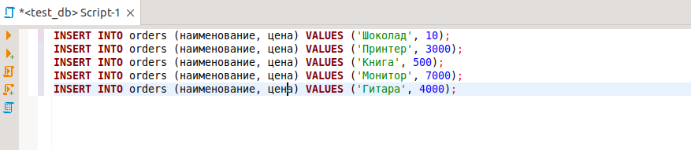  
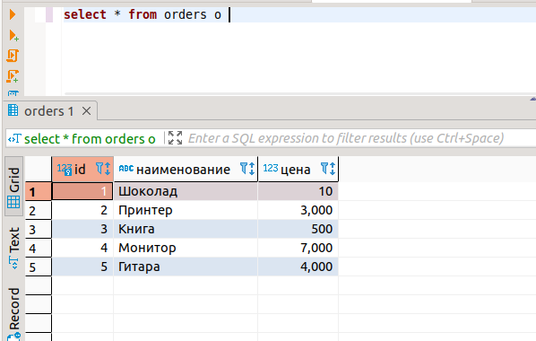  
   
```INSERT INTO clients (фамилия, страна_проживания) VALUES('Иванов Иван Иванович', 'USA');
INSERT INTO clients (фамилия, страна_проживания) VALUES('Петров Петр Петрович', 'Canada');
INSERT INTO clients (фамилия, страна_проживания) VALUES('Иоганн Себастьян Бах', 'Japan');
INSERT INTO clients (фамилия, страна_проживания) VALUES('Ронни Джеймс Дио', 'Russia');
INSERT INTO clients (фамилия, страна_проживания) VALUES('Ritchie Blackmore', 'Russia');```  
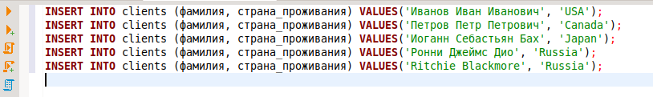  
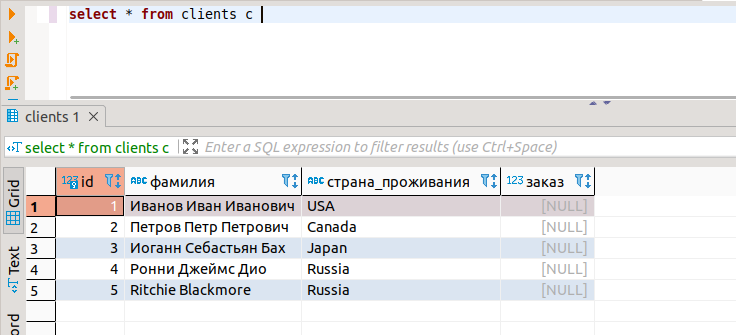  
  
Используя SQL синтаксис:
- вычислите количество записей для каждой таблицы 
`select count (*) from orders o;`  
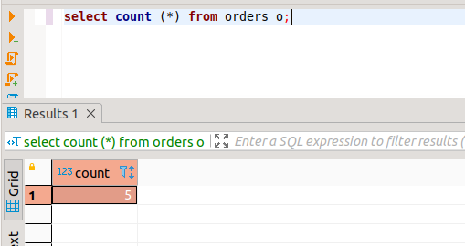  
  
`select count (*) from clients c;`  
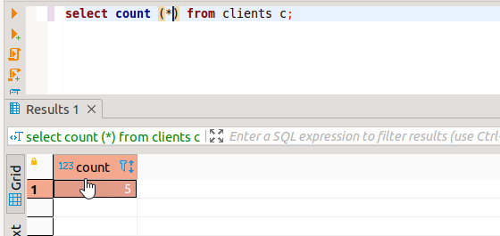  
  
4.  
  
Приведите SQL-запросы для выполнения данных операций.  
```update  clients set заказ = 3 where id = 1;
update  clients set заказ = 4 where id = 2;
update  clients set заказ = 5 where id = 3;```  
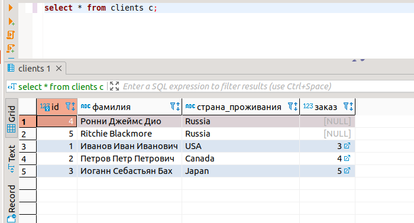  
  
Приведите SQL-запрос для выдачи всех пользователей, которые совершили заказ, а также вывод данного запроса.  
`select * from clients where заказ is not null`  
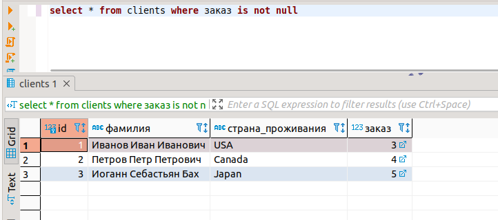  
  
5.  
  
`explain select * from clients where заказ is not null`
- Seq Scan - последовательное, чтение данных таблицы.  
- Cost - стоимость запроса *(0.00 - стоимость получения первого значения; 15.30 - стоимость выполнения всего запроса)*.  
- Rows — приблизительное количество возвращаемых строк при выполнении операции Seq Scan.  
- Width — средний размер одной строки в байтах.  
- Filter - фильтрация по полю *заказ*.  
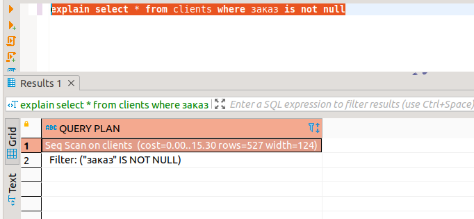  
  
6.  
  
Не выходя из контейнера создаем бэкап.  
`pg_dumpall -U postgres test_db > /var/lib/postgresql/backup/test_db.dump`  
  
  
  
Останавливаем контейнер.  
Поднимаем новый пустой контейнер.  
`docker run --rm --name postgres -e POSTGRES_PASSWORD=postgres -ti -p 5432:5432 -v backup:/var/lib/postgresql/backup postgres:12`  
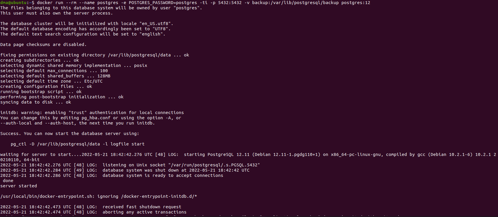  
  
Восстанавливаем из бэкапа БД test_db в новом контейнере.  
`psql -U postgres < /var/lib/postgresql/backup/test_db.dump`  
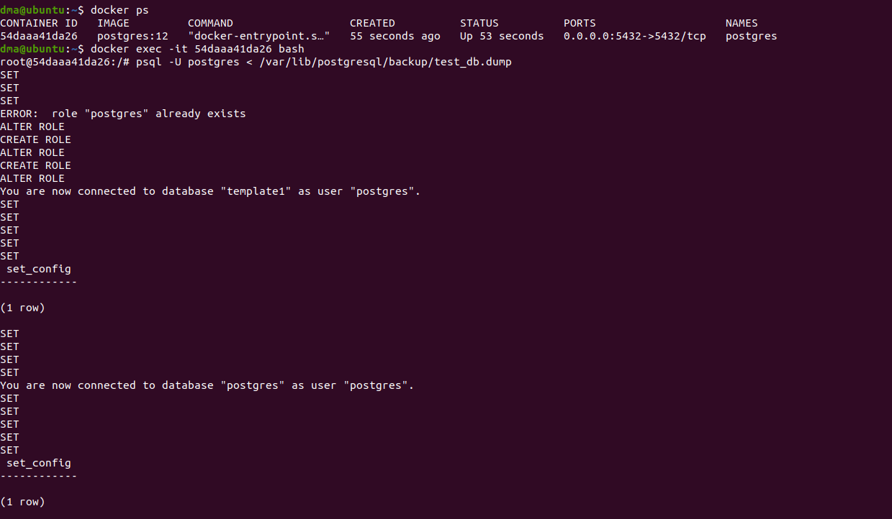  
  
Проверяем наличие таблиц.  
```\d clients
\d orders```  
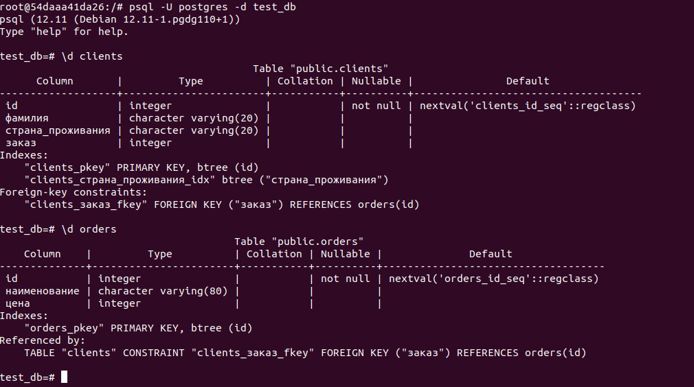  