# Домашнее задание к занятию "6.4. PostgreSQL"

1.  
  
Используя docker поднимите инстанс PostgreSQL (версию 13). Данные БД сохраните в volume.  
  
[postgres_13.yml](postgres_13.yml)  
  
```
docker pull postgres:13
cd 06-db-04-postgresql/
docker-compose -f postgres_13.yml up -d
```  
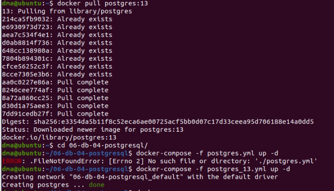  
  
Подключитесь к БД PostgreSQL используя `psql`.  
  
`psql -U postgres -p 5432`  
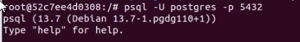  
  
Воспользуйтесь командой `\?` для вывода подсказки по имеющимся в `psql` управляющим командам.  
  
**Найдите и приведите** управляющие команды для:  
- вывода списка БД  
`\l[+]   [PATTERN]      list databases`  
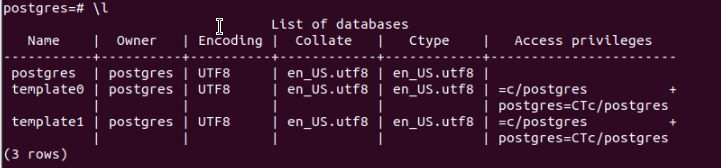  
  
- подключения к БД  
`\c[onnect] {[DBNAME|- USER|- HOST|- PORT|-] | conninfo}`  
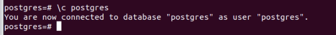  
  
- вывода списка таблиц  
`\dt[S+] [PATTERN]      list tables`  
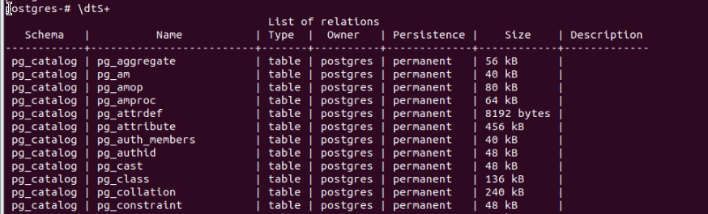  
  
- вывода описания содержимого таблиц  
`\d[S+]  NAME           describe table, view, sequence, or index`  
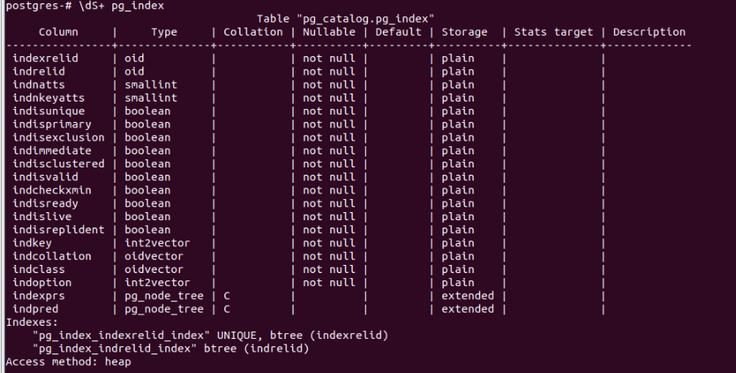  
  
- выхода из psql  
`\q                     quit psql`  
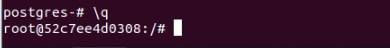  
  
2.  
  
Используя `psql` создайте БД `test_database`.  
`CREATE DATABASE test_database;`  
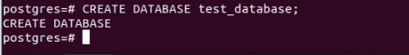  
  
Изучите [бэкап БД](https://github.com/netology-code/virt-homeworks/tree/master/06-db-04-postgresql/test_data).  
  
Восстановите бэкап БД в `test_database`.  
`psql -U postgres -d test_database < /var/lib/postgresql/backup/test_dump.sql`  
  
  
Перейдите в управляющую консоль `psql` внутри контейнера.  
  
Подключитесь к восстановленной БД и проведите операцию ANALYZE для сбора статистики по таблице.  
  
```
psql -U postgres -p 5432
\c test_database
ANALYZE VERBOSE public.orders;
```  
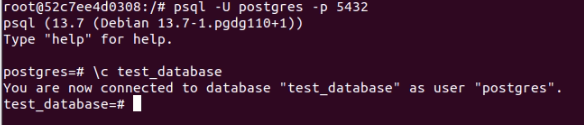  
  
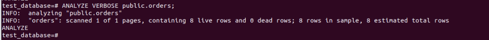  
  
Используя таблицу [pg_stats](https://postgrespro.ru/docs/postgresql/12/view-pg-stats), найдите столбец таблицы `orders` 
с наибольшим средним значением размера элементов в байтах.  
  
**Приведите в ответе** команду, которую вы использовали для вычисления и полученный результат.  
  
`select attname, avg_width from pg_stats where tablename='orders' order by attname desc limit 1;`  
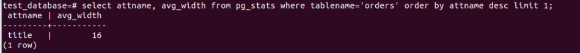  

3.  
  
Архитектор и администратор БД выяснили, что ваша таблица orders разрослась до невиданных размеров и
поиск по ней занимает долгое время. Вам, как успешному выпускнику курсов DevOps в нетологии предложили
провести разбиение таблицы на 2 (шардировать на orders_1 - price>499 и orders_2 - price<=499).  
  
Предложите SQL-транзакцию для проведения данной операции.  
  
```
alter table orders rename to orders_old;
create table orders (id integer, title varchar(80), price integer) partition by range(price);
create table orders_1 partition of orders for values from (499) to (9999999);
create table orders_2 partition of orders for values from (0) to (499);
insert into orders (id, title, price) select * from orders_old;
```  
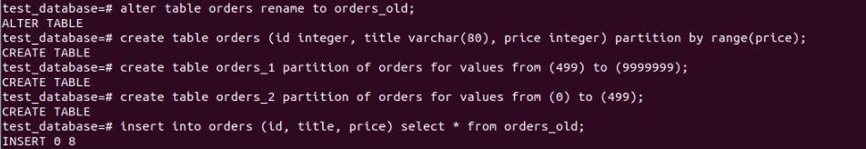  
  
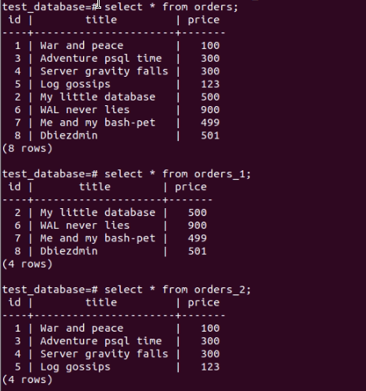  
  
Можно ли было изначально исключить "ручное" разбиение при проектировании таблицы orders?  
  
**При проектирования таблицы можно влючить для неё партицирование. Например: `create table orders (id integer, title varchar(80), price integer) partition by range(price);`***
  
4.  
  
Используя утилиту `pg_dump` создайте бекап БД `test_database`.  
  
`pg_dump -U postgres -d test_database > /var/lib/postgresql/backup/test_database_new.sql`  
  
  
Как бы вы доработали бэкап-файл, чтобы добавить уникальность значения столбца `title` для таблиц `test_database`?  
  
**Добавил свойство UNIQUE для поля `title` таблиц `orders`, `orders_1` и `orders_2`**  
  
[test_database_new.sql](test_database_new.sql)  
  
```
CREATE TABLE public.orders (
    id integer,
    title character varying(80) UNIQUE NOT NULL,
    price integer
)
PARTITION BY RANGE (price);
```  
  
```
CREATE TABLE public.orders_1 (
    id integer,
    title character varying(80) UNIQUE NOT NULL,
    price integer
);
```  
  
```
CREATE TABLE public.orders_2 (
    id integer,
    title character varying(80) UNIQUE NOT NULL,
    price integer
);
```  
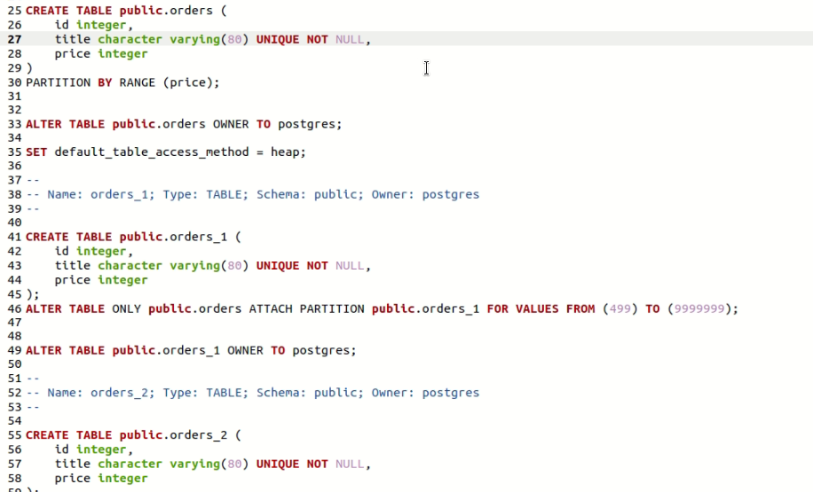  