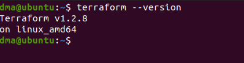
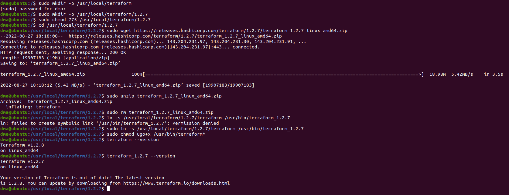

# Домашнее задание к занятию "7.1. Инфраструктура как код"

## Задача 1. Выбор инструментов. 
 
### Легенда
 
Через час совещание на котором менеджер расскажет о новом проекте. Начать работу над которым надо 
будет уже сегодня. 
На данный момент известно, что это будет сервис, который ваша компания будет предоставлять внешним заказчикам.
Первое время, скорее всего, будет один внешний клиент, со временем внешних клиентов станет больше.

Так же по разговорам в компании есть вероятность, что техническое задание еще не четкое, что приведет к большому
количеству небольших релизов, тестирований интеграций, откатов, доработок, то есть скучно не будет.  
   
Вам, как девопс инженеру, будет необходимо принять решение об инструментах для организации инфраструктуры.
На данный момент в вашей компании уже используются следующие инструменты: 
- остатки Сloud Formation, 
- некоторые образы сделаны при помощи Packer,
- год назад начали активно использовать Terraform, 
- разработчики привыкли использовать Docker, 
- уже есть большая база Kubernetes конфигураций, 
- для автоматизации процессов используется Teamcity, 
- также есть совсем немного Ansible скриптов, 
- и ряд bash скриптов для упрощения рутинных задач.  

Для этого в рамках совещания надо будет выяснить подробности о проекте, что бы в итоге определиться с инструментами:

1. Какой тип инфраструктуры будем использовать для этого проекта: изменяемый или не изменяемый?
  
```
Для начала точно будет изменяемый тип, т.к. это новый проект и в процессе его реализации явно потребуется вносить изменения в инфраструктуру, тем более что ТЗ еще не четкое. В дальнейшем возможно сменится на не изменяемый.
```
  
2. Будет ли центральный сервер для управления инфраструктурой?
  
```
На мой взгляд он не нужен, т.к. в компания пользуется Ansible и Terraform, а для них он не требуется.
```
  
3. Будут ли агенты на серверах?
  
```
Нет, т.к. опять же используются Ansible и Terraform для которых не нужны агенты.
```
  
4. Будут ли использованы средства для управления конфигурацией или инициализации ресурсов? 
  
```
Да, Terraform для инициализации ресурсов и Ansible для управления конфигурациями.
```
  
В связи с тем, что проект стартует уже сегодня, в рамках совещания надо будет определиться со всеми этими вопросами.

### В результате задачи необходимо

1. Ответить на четыре вопроса представленных в разделе "Легенда". 
  
```
Ответил в "Легенде". Опыта в проектировании инфрастуртуры у меня еще нет, так что  ответил исходя из знаний полученных в этой и предыдущих лекциях.
```
  
2. Какие инструменты из уже используемых вы хотели бы использовать для нового проекта?
  
```
Packer (для создания образов), Terraform (для инициализации ресурсов), Ansible (для управления конфигурациями), Docker (для самого сервиса), Teamcity (для CI/CD).
```
   
3. Хотите ли рассмотреть возможность внедрения новых инструментов для этого проекта? 
  
```
На мой взгляд для старта проекта выбранных инструментов достаточно. Также я бы добавил инструменты мониторинга (например Prometheus+Grafana) и систему сбора и обработки логов (например ELK).
```
  
Если для ответа на эти вопросы недостаточно информации, то напишите какие моменты уточните на совещании.  

## Задача 2. Установка терраформ. 

Официальный сайт: https://www.terraform.io/

Установите терраформ при помощи менеджера пакетов используемого в вашей операционной системе.
В виде результата этой задачи приложите вывод команды `terraform --version`.

```
Уже был установлен.
```
  
  
  
## Задача 3. Поддержка легаси кода. 

В какой-то момент вы обновили терраформ до новой версии, например с 0.12 до 0.13. 
А код одного из проектов настолько устарел, что не может работать с версией 0.13. 
В связи с этим необходимо сделать так, чтобы вы могли одновременно использовать последнюю версию терраформа установленную при помощи
штатного менеджера пакетов и устаревшую версию 0.12. 

В виде результата этой задачи приложите вывод `--version` двух версий терраформа доступных на вашем компьютере 
или виртуальной машине.

##### Ответ:
  
Т.к. у нас уже установлен Terraform версии 1.2.8, создадим директорию для версии 1.2.7 и перейдём в неё:  
  
```
sudo mkdir -p /usr/local/terraform
sudo mkdir -p /usr/local/terraform/1.2.7
sudo chmod 775 /usr/local/terraform/1.2.7
cd /usr/local/terraform/1.2.7
```
  
Скачаем версию 1.2.7 и распакуем её:  
  
```
sudo wget https://releases.hashicorp.com/terraform/1.2.7/terraform_1.2.7_linux_amd64.zip
sudo unzip terraform_1.2.7_linux_amd64.zip
```
  
Удалим скачанный архив чтобы не засорять систему:  
  
```
sudo rm terraform_1.2.7_linux_amd64.zip
```
  
Создадим симлик на версию 1.2.7:
  
```
ln -s /usr/local/terraform/1.2.7/terraform /usr/bin/terraform_1.2.7
```
  
Дадим права на выполнение:  
  
```
sudo chmod ugo+x /usr/bin/terraform*
```
  
Проверяем версии:  
  
  
  
*Также можно воспользоваться утилитами  [tfswitch](https://github.com/warrensbox/terraform-switcher)  или [tfenv](https://github.com/tfutils/tfenv).*
  
---

### Как cдавать задание

Выполненное домашнее задание пришлите ссылкой на .md-файл в вашем репозитории.

---